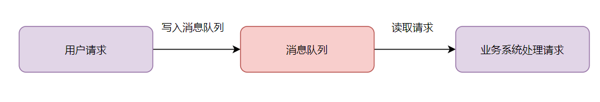
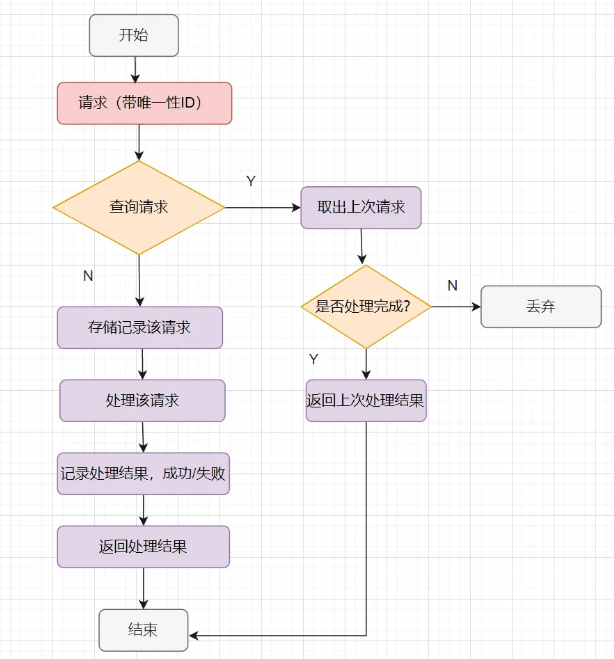

# 10万QPS高并发请求，如何防止重复下单

## **1. 前端拦截** 

首先因为**是10万QPS的高并发请求**，我们要保护好系统，那就是尽可能减少用户无效请求。

### **1.1 按钮置灰**

> 很多用户抢票、抢购、抢红包等时候，为了提高抢中的概率，都是疯狂点击按钮。会触发多次请求，导致重复下单。

因此，在用户点击过抢购按钮后，我们可以**给按钮置灰**，不让用户重复点击。

```javascript
const submitButton = document.getElementById('submit-order');
submitButton.disabled = true;  // 禁用按钮
// 提交订单的异步操作
submitOrder().then(response => {
  submitButton.disabled = false;  // 请求完成后恢复按钮
}).catch(error => {
  submitButton.disabled = false;  // 请求失败也恢复按钮
});
```

> 如果你的系统希望设计得友好一点，可以前端提示个文案，比如：已经收到你的请求，请耐心等待抢购结果。

### **1.2 Token机制**

- 前端加载页面的时候，获取一个全局唯一标记的token，如UUID。
- 在表单提交时，用该Token来标识该请求。每次请求都附带该Token，后端验证Token是否唯一。如果已提交过该Token的请求，则直接**返回错误或无效响应**，防止重复提交。

## **2.后端设计** 

### **2.1 NGINX 限流**

请求从前端到后端，首先是先到nginx ，我们可以在nginx做一下**限流**。

> 因为有些用户不怀好意，通过脚本绕过前端，疯狂请求。这类用户的IP和用户ID，我们都可以做一下限流的限制的。

一个Nginx限流配置：

```nginx
http {
    # 核心配置：IP+用户ID双因子限流 (按业务需求二选一)
    
    ## 选项1：基础版（纯IP限制）
    limit_req_zone $binary_remote_addr zone=order_base:10m rate=3r/m;  # 每IP每分钟3次

    ## 选项2：增强版（IP+用户ID，需前端传递UserID）
    limit_req_zone $binary_remote_addr$http_user_id zone=order_enhanced:20m rate=5r/m;

    server {
        listen 80;
        server_name tianluoboy.com;

        # 订单提交接口
        location = /v1/order/create {
            # 启用限流（示例用增强版）
            limit_req zone=order_enhanced burst=3 nodelay;  
            
            # 返回429时强制JSON响应
            error_page 429 @toofast;
            location @toofast {
                default_type application/json;
                return 200 '{"code":429,"msg":"操作过于频繁，请稍后再试"}';
            }

            # 反向代理到业务服务器
            proxy_pass http://order_backend;
        }

        # 其他接口不限流
        location / {
            proxy_pass http://default_backend;
        }
    }
}
```

### **2.2 网关（Spring Cloud Gateway）**

网关层可以做的事情很多，比如

> **Token 校验**：在网关层拦截请求，验证 Token 是否在 Redis 中存在.

```java
// 伪代码示例：网关过滤器校验 Token
if (redis.get(token) != null) {
    return error("重复请求");
} else {
    redis.setex(token, 60, "1"); // Token 有效期 60 秒
    //请求到后台
    passToBackend();
}
```

当然，网关也可以做**限流**的：

- **令牌桶算法**：通过Redis + Lua 实现集群级限流（如 redis-cell 模块）。
- **用户维度限流**：基于用户 ID或设备指纹限制并发请求数。

网关层可以做一下**请求排队**：

- **对高并发请求放到消息队列，削峰填谷**（如 Kafka/RabbitMQ）



### **2.3 幂等设计**

下单业务接口，我们一般要做**幂等的**。

一般用唯一索引做幂等设计。

> 唯一索引：比如使用用户ID + 商品ID + 时间戳组合生成唯一订单号。

一般的幂等处理就是这样啦，如下：



### **2.4 分库分表**

分库分表：按用户 ID 分片，分散写压力，避免单表成为瓶颈。

当业务量暴增的话，MySQL单机**磁盘容量会撑爆**。并且，我们知道数据库连接数是有限的。**在高并发的场景下**，大量请求访问数据库，`MySQL`单机是扛不住的！高并发场景下，会出现`too many connections`报错。

所以高并发的系统，**需要考虑拆分为多个数据库，来抗住高并发的毒打**。而假如你的单表数据量非常大，存储和查询的性能就会遇到瓶颈了，如果你做了很多优化之后还是无法提升效率的时候，就需要考虑做**分表**了。一般千万级别数据量，就需要**分表**，每个表的数据量少一点，提升SQL查询性能。

### **2.5 分布式锁**

既然是**防止重复下单**，一般都需要加Redis分布式锁的。

```java
// 伪代码：Redisson 分布式锁
RLock lock = redisson.getLock("order:lock:" + userId);
if (lock.tryLock(0, 30, TimeUnit.SECONDS)) {
    try {
        createOrder();
    } finally {
        lock.unlock();
    }
}
```

### **2.6 乐观锁兜底**

如果分布式锁失效了呢？怎么办呢?

我们可以加数据库乐观锁兜底。比如

> - 在数据订单表中添加 version 字段，每次更新都version+1，更新时校验版本号
> - 通过原子操作 `UPDATE ... SET version=version+1 WHERE order_id=xx AND version=old_version`实现

### **2.7 日志与监控**

要打印好日志，和做好监控指标，如果发现日志或者监控异常，可以快速介入排查~

### **2.8 核对数据**

我们要做好核对数据，比如做个定时任务，核对订单数据和交易金额是否对得上，如果发现数据异常，就人工快速介入排查和修复。