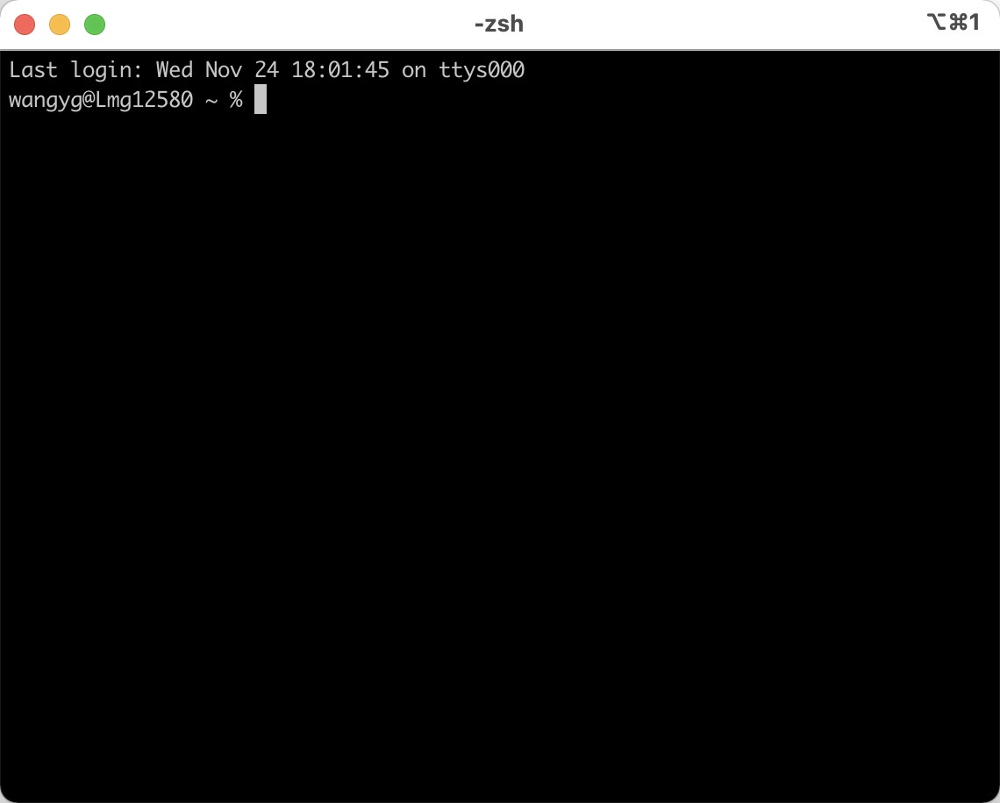

# iTerm2安装与配置

## 前言

​	最近工作学习中与Linux交互比较多，所以对ssh工具的要求逐渐提高，之前一直用的是SecureCRT，但是这是个收费软件，需要破解，而且在实际使用中也是各种bug层出不穷，让我很困扰，于是想找一款其它的ssh终端工具。在网上翻了很久，看到很多人都极力推荐iTerm2这个终端，他好用到什么程度呢，有人这么描述它：**iTerm2就是你要找的利器，如果你觉得不是，那就是你的问题**。好家伙，看到这样的描述。我不得不去研究一下了。

## 一、 下载安装iTerm2

官网地址：https://iterm2.com/

下载下来之后解压就是个可执行文件，激动的双击安装打开：




当我看到长这个样子的时候，心态都崩了，这tm是啥，还没有Mac自带的终端好看，难道是我打开的方式不对？

于是我又在网上查资料，原来iTerm2是可以配置主题的，比如：


嗯，总算是打消了我卸载它的念头。当然，它的优点可不仅仅是界面美观，还有许多便捷的操作，比如大家想象这样一个场景：当我们正在浏览网页或者正在全屏编辑器写代码写文章，突然想到了什么，或者发现了什么，想快速打开终端，执行一两条命令，然后关闭。

对于这种场景，我的愿景是可以通过快捷键迅速打开终端，然后用同样的快捷键迅速隐藏它，直到我需要时再来到我的面前。嗯，就是类似这样的便捷操作，iTerm2做了很多人性化的设计。

- 标签变色
- 智能选中
- 智能查找
- 切分屏幕
- ......

事物总是有两面性，它的优点确实很多，但也有缺点，那就是第一次配置的时候比较繁琐，如果没有配过的话估计能走不少坑，废话不多说，开始折腾吧。

## 二、 环境准备

1. **安装Command Line Tools**

```bash
> xcode-select --install
```

说明：这个工具是Mac环境下必不可少的工具，一般老司机应该都装的有，没有的必须装，要注意的是只是安装命令行工具Command Line Tools，一般几分钟搞定；而不是xcode软件，xcode有10多个G，装完就下班了。

2. **安装pip**

 方式一：

```bash
> sudo easy_install pip
```

说明：我用这种方式没装成功，报错，但很多人都是用的这种方式，可能是我的环境有问题吧。

方式二：

```bash
> curl 'https://bootstrap.pypa.io/get-pip.py' > get-pip.py
> sudo python3 get-pip.py
```

说明：我是用这种方式安装成功的，但是要注意：如果你的系统只有Python2的环境，请手动更新到Python3，并添加到环境变量，使Python3处于命令行可用状态。

3. **安装PowerLine**

```bash
> pip install powerline-status
```

说明：这一步比较简单，基本不会出什么问题。

Q：为什么要安装PowerLine？

A：它是用Python写的脚本用来美化终端的。

4. **安装PowerFonts**

这一步需要把字体库从github拉下来：

```bash
> git clone https://github.com/powerline/fonts.git
```

拉取下来以后，进入fonts目录，执行install.sh脚本，这样就完成了。

Q：为什么要安装PowerFonts，它有什么用？

A：因为后续我们要安装oh-my-zsh，许多oh-my-zsh主题需要安装Powerline字体才能正确渲染。

5. **安装oh-my-zsh**

因为Mac自带了zsh，所以最好先更新一下：

```bash
# 更新zsh
> brew install zsh zsh-completions
# 切换shell为zsh
> chsh -s /bin/zsh
# 重启终端，查看当前shell，输出/bin/zsh表示成功
> echo $SHELL
```

oh-my-zsh的安装官网提供了命令行安装的方式，但是走的是国外的网站，每次执行都超时，我们可以把它的githee源码拉到本地执行安装，效果也是一样的。

```bash
> git clone https://gitee.com/mirrors/oh-my-zsh.git
```

拉取下来以后，进入oh-my-zsh/tools目录执行install.sh脚本，成功之后会在~/目录下生成/.oh-my-zsh目录和/.zshrc目录。/.zshrc目录为配置目录，比如可以在配置文件中修改zsh主题：

```bash
> vi ~/.zshrc
ZSH_THEME="agnoster"
> source ~/.zshrc
```

修改完保存刷新配置文件，可以立马看到效果：


oh-my-zsh的主题非常丰富，可以在以下地址查看已有主题：

```bash
> ls ~/.oh-my-zsh/themes/
```

如有更多关于oh-my-zsh的问题，可以去官网查看：

地址：https://gitee.com/mirrors/oh-my-zsh

Q：oh-my-zsh是什么？

A：诸位大佬都知道，Linux下shell默认是bash，还有一种shell，叫做`zsh`它比bash更加强大，功能也更完善，但由于配置复杂所以流行度不高。是金子总会发光，开源界的大佬们是不会让明珠蒙尘，所以要感谢robbyrussell大佬，让我们用几行命令就可以使用zsh。

## 三、配置iTerm2界面

1. **悬浮窗口**

创建新的profile。打开Preferences -> Profiles，新建一个Profiles，取名HotKey window。

在Preferences -> Profiles -> Keys -> HotKey Window设置(我设置的是双击command键)。


这样就可以随时双击command键打开终端了。

2. **关闭启动界面**

如果你不想每次打开iTerm2都打开默认的窗口，可以在Appearance -> General 设置。


勾选上面选项以后，重新打开iTerm2就会跑到顶部状态栏，再也不会出现在Dock中，也不会在启动时给你打开一个默认的窗口。

3. **改变光标形状**

在Preferences -> Profiles -> Text 进行设置。


默认光标：


修改之后：


4. **自定义配色方案**

iTerm2提供了丰富的主题，我们可以直接拿来用。

地址：https://iterm2colorschemes.com/

这个地址如果访问慢的话可以直接克隆iTerm2的github仓库到本地。

地址：https://github.com/mbadolato/iTerm2-Color-Schemes

下载完成后打开设置：Preferences -> Profiles -> Colors -> Color Presets。点击import选择克隆下来的主题(在项目的schemes文件夹下)，可以全选，然后挑一个心仪的主题。


效果案例：


5. **剪贴板历史记录**

在iTerm2的窗口中，使用快捷键Command + Shift + h可以呼出粘贴历史，支持模糊搜索。


好了，关于iTerm2的玩法到这里就结束了，喜欢的小伙伴可以尝试一下~


