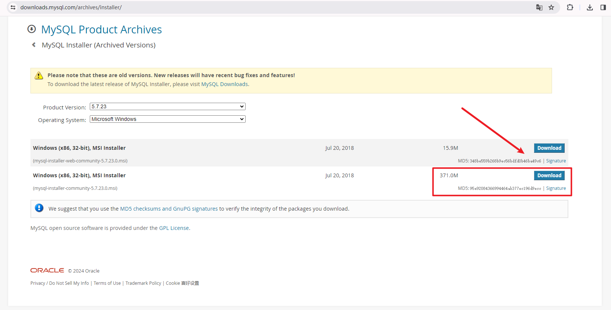
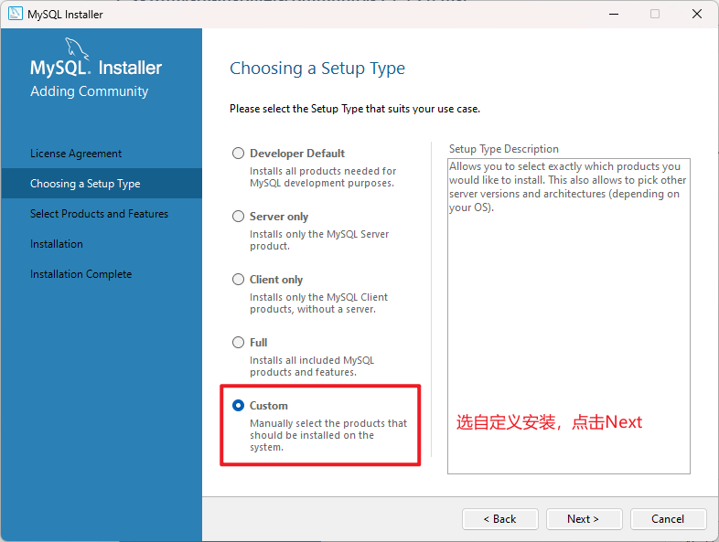
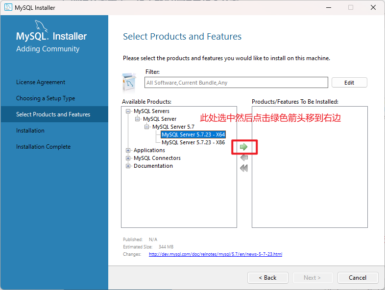
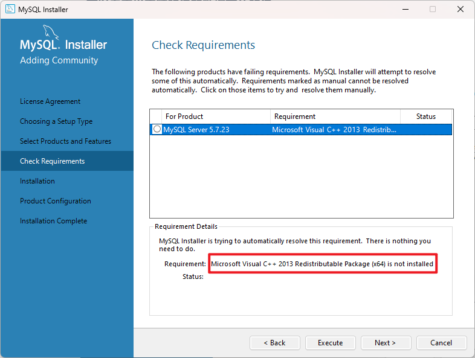
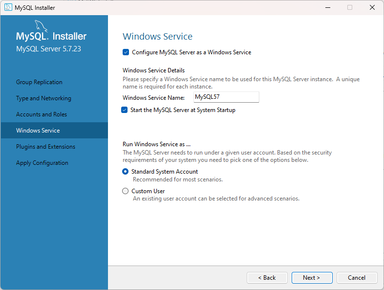
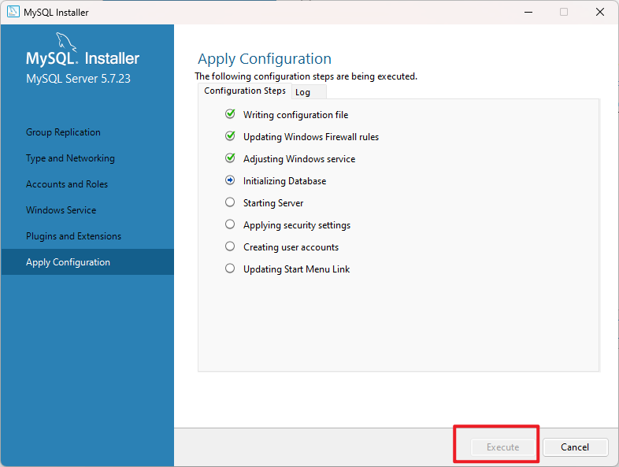
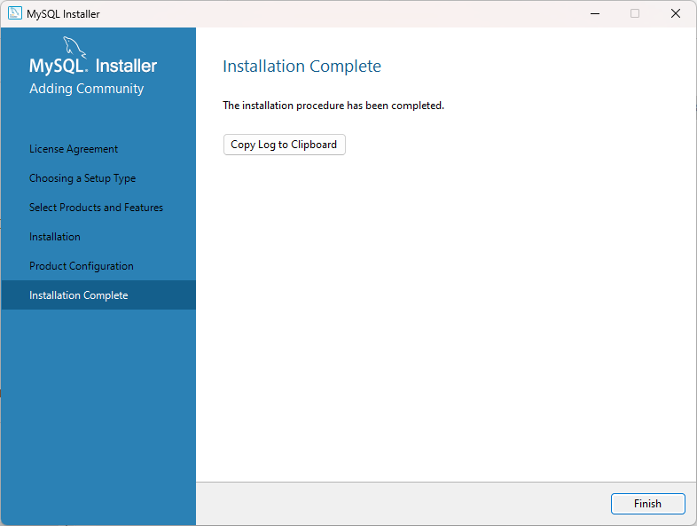
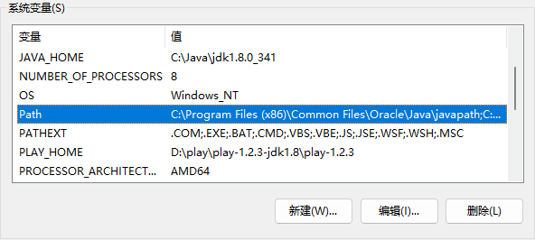

## Windows 11下MySQL5.7的下载及安装

### 一、下载MySQL

MySQL官网下载地址：https://downloads.mysql.com/archives/installer/

在下载列表中选择需要安装的版本：

下载完成后可以看到以下镜像：

### 二、安装MySQL

#### 1. 双击mysql-installer-community-5.7.23.0.msi

#### 2. 选择安装类型，这里我们选择自定义安装

#### 3. 选择安装的产品和功能

依次点开MySQL Servers -> MySQL Server -> MySQL Servers 5.7 -> MySQL Servers 5.7.23 - X64，然后点击绿色箭头。

注意：选择64位系统。

#### 4. 可以自定义安装路径和数据存放路径

#### 5. 点击下一步

到此处选中"MySQL Servers 5.7.23"，若电脑中没有这个环境，会提示安装"Microsoft Visual C++ 2013 Redistributable Package"，点击Execute。

但是在这一步大部分情况下会失败：

如未能自动安装成功，点击Cancel，然后移步这里；如果安装成功，则继续往下走。

#### 6. 执行完点击Next

#### 7. 一路点击下一步，直到这个界面

安装类型 个人开发学习 选择 **Development Compute** 

#### 8. 点击下一步，设置MySQL密码

点击执行

#### 9. 点击Finish

#### 10. 至此MySQL5.7安装完成！

### 三、验证安装

#### 1. 设置环境变量

到MySQL安装目录下，复制完整bin路径；

#### 2. 进入环境变量设置

右击**此电脑**，选择**属性**，先点击“**高级系统设置**”，再点击“**环境变量**”；

在“**系统变量**”中选择“**Path**”，点击“**编辑**”；

然后点击“**新建**”，将MySQL的安装路径添加上去，之后点击“**确定**”； 

#### 3. 验证环境变量是否配置好

在cmd中输入以下命令：

> mysql -uroot -p 安装时候设置的密码

#### 4. 出现以下界面，则代表大功告成！

### 四、安装失败

#### 1. 重新安装

如果安装失败直接重新安装，进入到以下步骤的时候就没有5.7的版本了，需要卸载重新安装

#### 2. 卸载重新安装

如果在安装的过程中，因为设备中没有Microsoft Visual C++ 2013环境导致安装失败，需要在控制面版中卸载重新安装。

#### 3. 下载Microsoft Visual C++ 2013包

Microsoft Visual C++ 2013下载地址：https://www.microsoft.com/zh-cn/download/details.aspx?id=40784

选择要下载的程序，我这里下载的是 vcredist_x64.exe，因为我前面选择安装的是64位的MySQL。

#### 4. 双击执行，点击安装

#### 5. 点击关闭，回到第一步重新安装MySQL