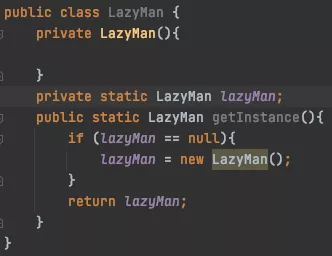
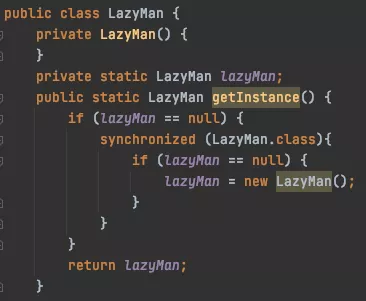
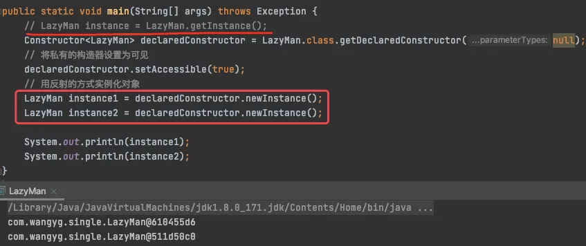
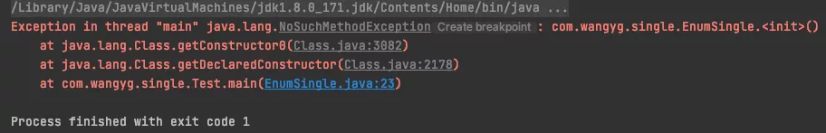
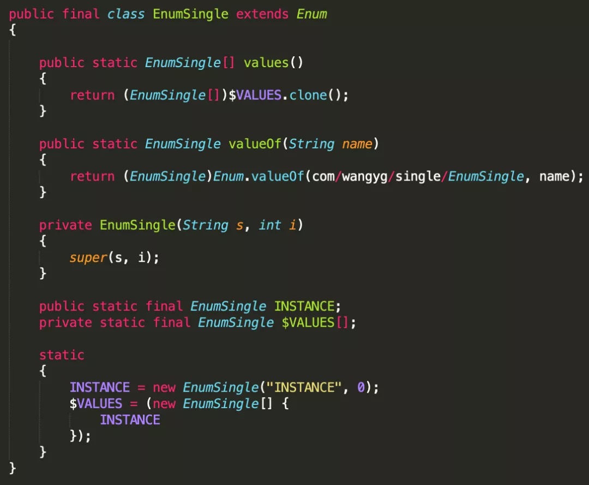

## 什么是单例模式？

这种模式涉及到一个单一的类，该类负责创建自己的对象，同时确保只有单个对象被创建。这个类提供了一种访问其唯一的对象的方式，可以直接访问，不需要实例化该类的对象。

#### 饿汉式单例
最简单的单例模式：

缺点：饿汉式，顾名思义上来就要吃，即这个类一加载就实例化对象，如果不使用，会造成内存资源的浪费。
优点：线程安全。

#### 懒汉式单例
懒汉式单例是对饿汉式的优化，既然饿汉式类加载就实例化对象，那么改成调用方法时才实例化对象，这样就不会造成内存资源的浪费。

这样的方式在单线程下是没有问题的，但是在多线程下，就会出问题：

从执行结果可以看到打印出两个线程，单例被破坏！
【分析】
    在多线程下，一个线程进入了if(lazyMan == null)判断语句块，还未来得及往下执行，另一个线程也通过了这个判断语句，这时便会产生多个实例。所以在多线程环境下不可使用这种方式。

#### 双重检测锁模式(DCL懒汉式)

想要解决懒汉式在多线程下的问题，首先想到的就是加锁：

Q：DCL懒汉式安全吗？
A：不安全
【分析】lazyMan = new LazyMan();

这行代码其实不是一个原子操作，它的执行分为3步：

1. 分配内存空间
2. 执行构造方法，初始化(init)
3. 把lazyMan指向内存空间

​	我们期望的执行顺序是123，但是有可能指令重排之后的执行顺序是132，即先分配内存空间后，把lazyMan指向内存空间，然后再执行构造方法，这种情况是可能产生的；但是如果执行了3还未执行2之前，又有一个线程B进入，B线程会判断lazyMan不为空，直接返回，线程B使用的时候就会报错(对象尚未初始化)。

> synchronized虽然保证了线程的原子性（即synchronized块中的语句要么全部执行，要么一条也不执行），但单条语句编译后形成的指令并不是一个原子操作（即可能该条语句的部分指令未得到执行，就被切换到另一个线程了）

所以针对上述问题，需要使用volatile修饰变量lazyMan，防止指令重排。

#### 双重检测锁+volatile防止指令重排

到这里算是一个比较完整的单例模式了，除此之外还有一种“看起来比较安全”的单例模式写法。

#### 静态内部类式单例

【分析】

    这种方式采用了类装载的机制来保证初始化实例时只有一个线程。
    
    静态内部类方式在Holder类被装载时并不会立即实例化，而是在需要实例化时，调用getInstance()方法，才会装载InnerClass类，从而完成Holder的实例化。
    
    类的静态属性只会在第一次加载类的时候初始化，所以在这里，JVM帮助我们保证了线程的安全性，在类进行初始化时，别的线程是无法进入的。

上述两种方式看似比较安全，其实不然，要知道java里有个霸道的技术「反射」，

接下来进入炫技时刻(⁎⁍̴̛ᴗ⁍̴̛⁎)
先试一下最牛逼的“双重检测锁+volatile防止指令重排”

可以看到输出两个不同的对象，单例被破坏！
【分析】

上面利用反射破坏单例的原理是破坏了无参构造器，那我们直接在无参构造函数里加判断就行了。

再次执行反射函数，执行结果如下：

可以看到这样就解决了这种反射方式的破坏，但是这样还是不安全。修改反射方法实例化的方式：

发现又被破坏了！

魔高一尺，道高一丈。这种破坏也不是没办法解决的，这种场景下使用红绿灯的思想去修改，即随便声明一个变量(假设为abc)：

执行结果：

可以看到使用这种方式可以避免单例被破坏。
【说明】
    这里的变量只是一种思想，如果不通过反编译的情况下，是找不到这个变量的，即使反编译找到了，对变量进行加密，也可以让单例变的安全。但还是那句话，魔高一尺，道高一丈，你能加密，我就能解密。假设我解密得到了变量abc，通过反射，依旧可以破坏。

执行结果：

又双叒叕被破坏了 ！

**Q：用反射可以破坏枚举吗？**

看一下newInstance()的源码：

可以看到里面的关键点：

如果是枚举类型就会抛出异常(不能通过反射创建枚举对象)
> 反射里的newInstance()本质上也是调用了类的无参构造器创建对象的。

先写一个简单的案例测试一下枚举的单例：

返回的是同一个对象，单例没问题，接下来尝试破坏一下。

1. 看一下idea编译后的代码，这是从target/classes/文件夹下生成的，可以看到里面有一个无参构造方法，那我们就找到入手点了。

2. 还是利用上面反射的方式破坏

执行结果：

报错说没有这个方法，说明枚举类里并没有私有构造器方法，但是刚才明明看到了，难道是我瞎了？

而且反射的实例化方法newInstance()对于破坏枚举类抛的异常也不是这个，探究失败！

3. 使用jad将EnumSingle.class反编译

能看到确实没有无参构造器，而是有一个有参构造器！

4. 使用反射的时候，构造器传入参数

执行结果：

看到这个错，才能真正的证明枚举类型的单例确实不能被单例破坏，因为Java反射规则中，人家定义了，只要你是枚举类，我就抛异常！

## 总结

在日常工作中，饿汉式，双重检测锁+volatile模式，静态内部类和枚举都是不错的单例模式选择，根据不同的场景选择不同的模式。