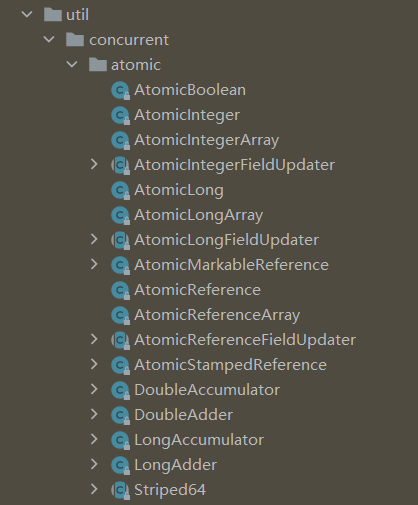

# 一道有意思的题目

## 看题

前一段时间面试碰见一道题目，感觉挺有意思，特意记录了下来。

大概内容就是有一个全局变量`i`，然后在main方法中有两个嵌套for循环，分别循环100次，然后循环中，开启新线程对变量`i`执行i++的操作。我对其简单做了一下修改。

一起来看下这道题目，不运行，用肉眼的看的话，你觉得是多少？给你1min思考......

```java
private static int i = 0;

public static void add() {
  i++;
}

public static void main(String[] args) {
  for (int j = 0; j < 100; j++) {
    new Thread(() -> {
      for (int k = 0; k < 100; k++) {
        add();
      }
    }).start();
  }
  System.out.println(i);
}
```

理想情况下，输出应该是10000才对。但是以我们多年的做题经验，即使不知道是多少，但它肯定不是10000，明显有坑让我们跳。


如果基础好点的同学，应该能猜测到输出肯定是小于等于10000的。那到底是多少，这道题考察什么知识点？

## 问题一：线程未执行完就输出

可能有些同学一眼就看出来是对共享变量修改的问题，然后急于回答，那你上来就错了。

第一个大坑，上面的代码在循环中开启了很多线程执行add，但是你并不能保证主线程输出之前，循环里的线程都执行完毕。


所以第一步要解决的就是等待子线程执行完成，主线程再输出才可以，如果没做这一步，后面的问题就别聊了。

修改以上代码：

```java
private static int i = 0;

public static void add() {
  i++;
}

public static void main(String[] args) {
  for (int j = 0; j < 100; j++) {
    new Thread(() -> {
      for (int k = 0; k < 100; k++) {
        add();
      }
    }).start();
  }
  // 保证子线程执行完毕
  while (Thread.activeCount() > 2) {
      Thread.yield();
  }
  System.out.println(i);
}
```

## 问题二：内存可见性

在JMM内存模型中，分为主存和工作内存，变量`i`的值在主存中，每个新开启的线程都有自己的工作内存，并且每个工作线程都有一份主存变量的副本。


比如线程A拿到变量并且执行完以后，将`i`的值`2`同步到主存之前；线程B拿到了`i`的值，执行add操作；这时候线程A将新值`2`同步到了主存中；线程B紧接着也执行完了add操作，同样的将新值`2`同步到了主存中。

本来这时候主存中`i`的值应该为3，但是却少了。

> 当然这只是随便举的一个例子，还有很多场景会导致丢失自增。


学过JMM的都知道，在Java中提供了一个关键字volatile，他能保证线程可见性，我们可以给变量`i`加上关键字再试一下。

```java
private static volatile int i = 0;
```

输出结果：

```markdown
9632

Process finished with exit code 0
```

可以看到还是不等于10000，说明还有别的问题，但起码我们排除了内存可见性的问题。

## 问题三、i++线程不安全

i++并不是一个原子性操作，在反编译后i++的class文件中，包含以下三步：

```java
1. getstatic    // 读取i的当前值
2. iadd			// 将i的值加1
3. putstatic 	// 将新的值写回1
```

如果在某个线程执行这三个步骤的时候，另一个线程也进行了同样的操作，那么结果可能会丢失一次自增或者多次自增的情况。


结合问题二，可以得出结论，volatile虽然可以保证内存可见性，但是不能保证原子性。

##  如何解决

既然知道了是i++非原子性操作的问题，那我们就围绕它来想办法。

### 1. 加锁

使用synchronized或Lock锁等同步机制

```java
private static int i = 0;

public static synchronized void add() {
  i++;
}
```

多次执行，结果一直是10000，说明问题已修复。

```java
10000

Process finished with exit code 0
```

但是你有没有发现，我这里的变量`i`并没有用volatile修饰，难道它不存在内存可见性问题吗？


基础知识点是不是忘了：

 `synchronized`能保证内存可见性 。 当一个线程退出`synchronized`代码块时，它会刷新该代码块中所有变量的修改到主内存中。同时，当另一个线程进入`synchronized`代码块时，它会从主内存中获取最新的变量值。因此，`synchronized`不仅能确保同一时刻只有一个线程访问共享资源（即互斥性），还能确保内存可见性，即一个线程对共享变量的修改能够被其他线程看到。 

>  需要注意的是，虽然 `synchronized` 保证了同一时刻只有一个线程访问共享变量，但它并不能保证其他非同步访问 `i` 的操作的可见性。如果你在其他地方直接读取或修改 `i` 的值而没有使用 `synchronized` 或其他同步机制，那么可能会出现内存可见性问题。为了确保所有对 `i` 的访问都具有可见性，可以将 `i` 声明为 `volatile`。 

### 2. 使用原子类

在juc的包下，有一个atomic包，里面提供了许多原子类，这些原子类中的方法都来自Unsafe类，能够保证操作的原子性。



我们将代码做一下修改：

```java
private static AtomicInteger i = new AtomicInteger();

public static void add() {
    i.getAndIncrement();
}
```

多次执行，结果一直是10000，说明这种方式也可以解决以上问题。

## 总结

通过以上问题的讨论，总结一下知识点：

1. volatile可以保证可见性，但不能保证原子性；
2. i++线程不安全，可以通过加锁或者原子类的方式去解决；
3. synchronized可以保证内存可见性，但仅仅是被修饰的代码块或方法。