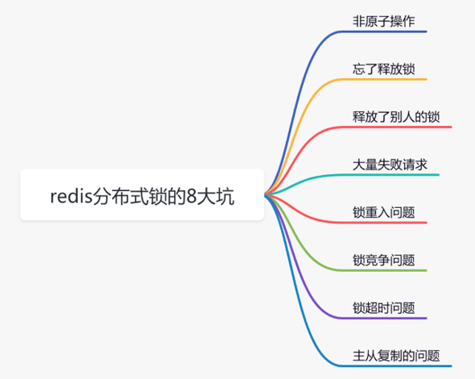
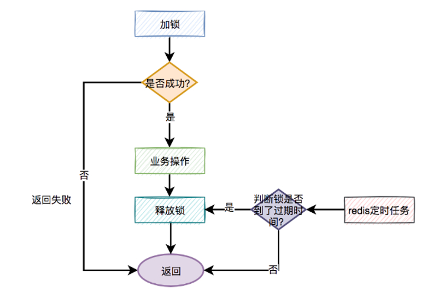
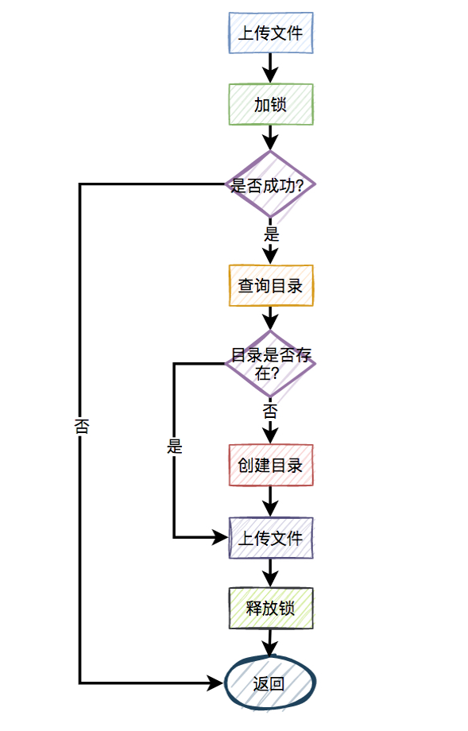
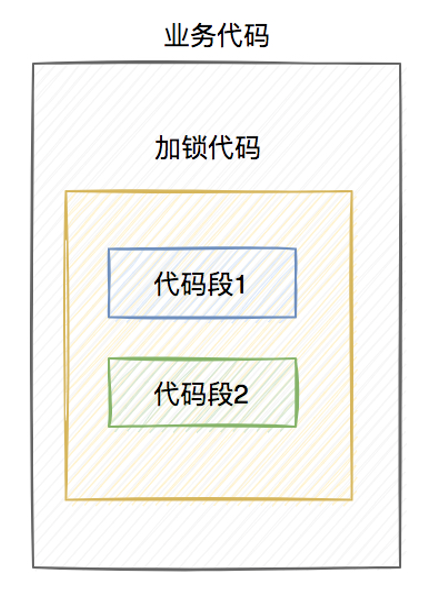
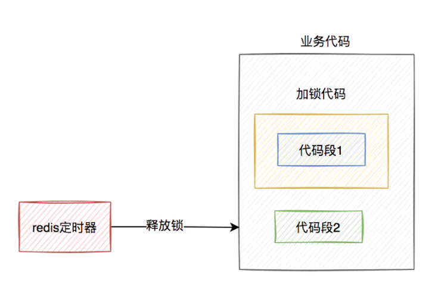
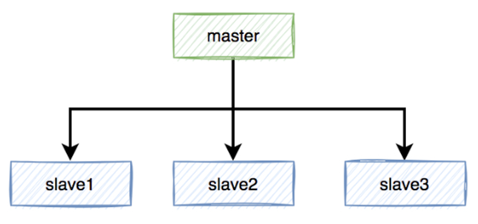
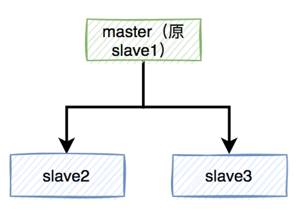

在分布式系统中，由于redis分布式锁相对于更简单和高效，成为了分布式锁的首选，被我们用到了很多实际业务场景当中。

但不是说用了redis分布式锁，就可以高枕无忧了，如果没有用好或者用对，也会引来一些意想不到的问题。

今天我们就一起聊聊redis分布式锁的一些坑，给有需要的朋友一个参考。



## 1. 非原子操作

使用redis的分布式锁，我们首先想到的可能是 `setNx` 命令。

```java
if (jedis.setnx(lockKey, val) == 1) {
    jedis.expire(lockKey, timeout);
}
```

容易，三下五除二，我们就可以把代码写好。

这段代码确实可以加锁成功，但你有没有发现什么问题？

`加锁操作`和后面的`设置超时时间`是分开的，并`非原子操作`。

假如加锁成功，但是设置超时时间失败了，该lockKey就变成永不失效。假如在高并发场景中，有大量的lockKey加锁成功了，但不会失效，有可能直接导致redis内存空间不足。

那么，有没有保证原子性的加锁命令呢？

答案是：有，请看下面。

## 2. 忘了释放锁

上面说到使用 `setNx` 命令加锁操作和设置超时时间是分开的，并非原子操作。

而在redis中还有 `set` 命令，该命令可以指定多个参数。

```java
String result = jedis.set(lockKey, requestId, "NX", "PX", expireTime);
if ("OK".equals(result)) {
    return true;
}
return false;
```

其中：

- `lockKey`：锁的标识
- `requestId`：请求id
- `NX`：只在键不存在时，才对键进行设置操作。
- `PX`：设置键的过期时间为 millisecond 毫秒。
- `expireTime`：过期时间

`set` 命令是原子操作，加锁和设置超时时间，一个命令就能轻松搞定。


nice


使用 `set` 命令加锁，表面上看起来没有问题。但如果仔细想想，加锁之后，每次都要达到了超时时间才释放锁，会不会有点不合理？加锁后，如果不及时释放锁，会有很多问题。

分布式锁更合理的用法是：

1. **手动加锁**
2. **业务操作**
3. **手动释放锁**
4. **如果手动释放锁失败了，则达到超时时间，redis会自动释放锁。**

大致流程图如下：



那么问题来了，如何释放锁呢？

伪代码如下：

```java
try {
    String result = jedis.set(lockKey, requestId, "NX", "PX", expireTime);
    if ("OK".equals(result)) {
        return true;
    }
    return false;
} finally {
    unlock(lockKey);
}
```

需要捕获业务代码的异常，然后在 `finally` 中释放锁。换句话说就是：无论代码执行成功或失败了，都需要释放锁。

此时，有些朋友可能会问：假如刚好在释放锁的时候，系统被重启了，或者网络断线了，或者机房断电了，不也会导致释放锁失败？

这是一个好问题，因为这种小概率问题确实存在。

但还记得前面我们给锁设置超时时间吗？即使出现异常情况造成释放锁失败，但到了我们设置的超时时间，锁还是会被redis自动释放。

但只在finally中释放锁，就够了吗？

## 3. 释放了别人的锁

做人要厚道，先回答上面的问题：只在finally中释放锁，当然是不够的，因为释放锁的姿势，还是不对。

哪里不对？

答：在多线程场景中，可能会出现释放了别人的锁的情况。

有些朋友可能会反驳：假设在多线程场景中，线程A获取到了锁，但如果线程A没有释放锁，此时，线程B是获取不到锁的，何来释放了别人的锁之说？

答：假如线程A和线程B，都使用lockKey加锁。线程A加锁成功了，但是由于业务功能耗时时间很长，超过了设置的超时时间。这时候，redis会自动释放lockKey锁。此时，线程B就能给lockKey加锁成功了，接下来执行它的业务操作。恰好这个时候，线程A执行完了业务功能，接下来，在finally方法中释放了锁lockKey。这不就出问题了，线程B的锁，被线程A释放了。

我想这个时候，线程B肯定哭晕在厕所里，并且嘴里还振振有词。

那么，如何解决这个问题呢？

不知道你们注意到没？在使用 `set` 命令加锁时，除了使用lockKey锁标识，还多设置了一个参数：`requestId`，为什么要需要记录requestId呢？

答：requestId是在释放锁的时候用的。

伪代码如下：

```java
if (jedis.get(lockKey).equals(requestId)) {
    jedis.del(lockKey);
    return true;
}
return false;
```

在释放锁的时候，先获取到该锁的值（之前设置值就是requestId），然后判断跟之前设置的值是否相同，如果相同才允许删除锁。返回成功。如果不同，则直接返回失败。

> 换句话说就是：自己只能释放自己加的锁，不允许释放别人加的锁。

这里为什么要用requestId，而userId不行吗？

答：如果用userId的话，对于请求来说并不唯一，多个不同的请求，可能使用同一个userId。而requestId是全局唯一的，不存在加锁和释放锁乱掉的情况。

此外，使用lua脚本，也能解决释放了别人的锁的问题：

```java
if redis.call('get', KEYS[1]) == ARGV[1] then
    return redis.call('del', KEYS[1])
else
    return 0
end
```

lua脚本能保证查询锁是否存在和删除锁是原子操作，用它来释放锁效果更好一些。

说到lua脚本，其实加锁操作也建议使用lua脚本：

```java
if redis.call('exists', KEYS[1]) == 0 then
    redis.call('hset', KEYS[1], ARGV[2], 1);
    redis.call('pexpire', KEYS[1], ARGV[3]);
    return nil;
end
if (redis.call('hexists', KEYS[1], ARGV[2]) == 1) then
    redis.call('hincrby', KEYS[1], ARGV[2], 1);
    redis.call('pexpire', KEYS[1], ARGV[3]);
    return nil;
end
return redis.call('pttl', KEYS[1]);
```

这是redisson框架的加锁代码，写的不错，大家可以借鉴一下。

有题，下面还有哪些好玩的东西？

## 4. 大量失败请求

上面的加锁方法看起来好像没有问题，如果你仔细想想，如果有1万的请求同时去竞争那把锁，可能只有一个请求是成功的，其余的9999个请求都会失败。

在秒杀场景下，会有什么问题？

答：每1万个请求，有1个成功。再1万个请求，有1个成功。如此下去，直到库存不足。这就变成了均匀分布的秒杀了，跟我们想象中的不一样。

如何解决这个问题呢？

此外，还有一种场景：

比如，有两个线程同时上传文件到sftp，上传文件前先要创建目录。假设两个线程需要创建的目录名都是当天的日期，比如：20210920，如果不做任何控制，直接并发的创建目录，第二个线程必然会失败。

这时候有些朋友可能会说：这还不容易，加一个redis分布式锁就能解决问题了，此外再判断一下，如果目录已经存在就不创建，只有目录不存在才需要创建。

伪代码如下：

```java
try {
     String result = jedis.set(lockKey, requestId, "NX", "PX", expireTime);
        if ("OK".equals(result)) {
            if(!exists(path)){
                mkdir(path);
            }
            return true;
        }
} finally{
    unlock(lockKey,requestId);
}
return false;
```

一切看似美好，但经不起仔细推敲。

来自灵魂的一问：第二个请求如果加锁失败了，接下来，是返回失败，还是返回成功呢？

主要流程图如下：



显然第二个请求，肯定是不能返回失败的，如果返回失败了，这个问题还是没有被解决。如果文件还没有上传成功，直接返回成功会有更大的问题。头疼，到底该如何解决呢？

答：使用`自旋锁`。

```java
try {
    Long start = System.currentTimeMillis();
    while(true) {
        String result = jedis.set(lockKey, requestId, "NX", "PX", expireTime);
        if ("OK".equals(result)) {
            if(!exists(path)){
                mkdir(path);
            }
            return true;
        }
        long time = System.currentTimeMillis() - start;
        if (time>timeout) {
            return false;
        }
        try {
            Thread.sleep(50);
        } catch (InterruptedException e) {
            e.printStackTrace();
        }
    }
} finally{
    unlock(lockKey,requestId);
}
```
在规定的时间，比如500毫秒内，自旋不断尝试加锁（说白了，就是在死循环中，不断尝试加锁），如果成功则直接返回。如果失败，则休眠50毫秒，再发起新一轮的尝试。如果到了超时时间，还未加锁成功，则直接返回失败。
好吧，学到一招了，还有吗？

## 5. 锁重入问题

我们都知道redis分布式锁是互斥的。假如我们对某个key加锁了，如果该key对应的锁还没失效，再用相同key去加锁，大概率会失败。

没错，大部分场景是没有问题的。

为什么说是大部分场景是没问题的。

因为还有这样的场景：

假设在某个请求中，需要获取一颗满足条件的菜单树或者分类树。我们以菜单为例，这就需要在接口中从根节点开始，递归遍历出所有满足条件的子节点，然后组装成一颗菜单树。

需要注意的是菜单不是一成不变的，在后台系统同学可以动态添加、修改和删除菜单。为了保证在并发的情况下，每次都可能获取最新的数据，这里可以加redis分布式锁。

但redis分布式锁的思路是对的。但接下来问题来了，在递归方法中递归遍历多次，每次都是加的同一把锁。递归第一层当然是可以加锁成功的，但递归第二层、第三层...第N层，不就会加锁失败了？

递归方法中加锁的伪代码如下：

```java
private int expireTime = 1000;

public void func(int level,String lockKey,String requestId) {
    try {
        String result = jedis.set(lockKey, requestId, "NX", "PX", expireTime);
        if ("OK".equals(result)) {
            if(level<=10){
                this.func(++level,lockKey,requestId);
            } else {
            	return;
        	}
        }
        return;
    } finally {
        unlock(lockKey,requestId);
    }
}
```

如果你直接这么用，看起来好像没有问题。但最终执行程序之后发现，等待你的结果只有一个：`出现异常`。

因为从根节点开始，第一层递归加锁成功，还没释放锁，就直接进入第二层递归。因为锁名为lockKey，并且值为requestId的锁已经存在，所以第二层递归大概率会加锁失败，然后返回到第一层。第一层接下来正常释放锁，然后整个递归方法直接返回了。

这下子，大家知道出现什么问题了吧？

没错，递归方法其实只执行了第一层递归就返回了，其他层递归由于加锁失败，根本没法执行。

那么这个问题该如何解决呢？

答：使用`可重入锁`。

我们以redisson框架为例，它的内部实现了可重入锁的功能。

古时有句话说得好：为人不识陈近南，便称英雄也枉然。

我说：分布式锁不识redisson，便称好锁也枉然。哈哈哈，只是自娱自乐一下。

 由此可见，redisson在redis分布式锁中的江湖地位很高。 

 伪代码如下： 

```java
private int expireTime = 1000;

public void run(String lockKey) {
    RLock lock = redisson.getLock(lockKey);
    this.func(lock,1);
}

public void func(RLock lock,int level){
    try {
        lock.lock(5, TimeUnit.SECONDS);
        if(level<=10){
            this.func(lock,++level);
        } else {
            return;
        }
    } finally {
        lock.unlock();
    }
}
```

上面的代码也许并不完美，这里只是给了一个大致的思路，如果大家有这方面需求的话，以上代码仅供参考。

接下来，聊聊redisson可重入锁的实现原理。

加锁主要是通过以下脚本实现的：

```java
if (redis.call('exists', KEYS[1]) == 0) then
    redis.call('hset', KEYS[1], ARGV[2], 1);
    redis.call('pexpire', KEYS[1], ARGV[1]);
    return nil;
end
if (redis.call('hexists', KEYS[1], ARGV[2]) == 1) 
then
    redis.call('hincrby', KEYS[1], ARGV[2], 1);
    redis.call('pexpire', KEYS[1], ARGV[1]);
    return nil;
end;
return redis.call('pttl', KEYS[1]);
```

其中：

- KEYS[1]：锁名
- ARGV[1]：过期时间
- ARGV[2]：uuid + ":" + threadId，可以认为是requestId

1. 先判断如果锁名不存在，则加锁。
2. 接下来，判断如果锁名和requestId值都存在，则使用hincrby命令给该锁名和requestId值计数，每次都加1。注意一下，这里就是重入锁的关键，锁重入一次值就加1。
3. 如果锁名存在，但值不是requestId，则返回过期时间。

释放锁主要是通过以下脚本实现的：

```lua
if (redis.call('hexists', KEYS[1], ARGV[3]) == 0) 
then
    return nil;
end
local counter = redis.call('hincrby', KEYS[1], ARGV[3], -1);
if (counter > 0) then
    redis.call('pexpire', KEYS[1], ARGV[2]);
    return 0;
else
    redis.call('del', KEYS[1]);
    redis.call('publish', KEYS[2], ARGV[1]);
    return 1;
end
```

1. 先判断如果锁名和requestId值不存在，则直接返回。
2. 如果锁名和requestId值存在，则重入锁减1。
3. 如果减1后，重入锁的value值还大于0，说明还有引用，则重试设置过期时间。
4. 如果减1后，重入锁的value值还等于0，则可以删除锁，然后发消息通知等待线程抢锁。

> 再次强调一下，如果你们系统可以容忍数据暂时的不一致，有些场景不加锁也行，我在这里只是举个例子，本节内容并不适用于所有场景。

## 6. 锁竞争问题

如果有大量需要写入数据的业务场景，使用普通的redis分布式锁是没有问题的。

但如果有些业务场景，写入的操作比较少，反而有大量读取的操作。这样直接使用普通的redis分布式锁，会不会有点浪费性能呢？

我们都知道，锁的粒度越粗，多个线程抢锁时竞争就越激烈，造成多个线程锁等待的时间也就越长，性能也就越差。

所以，提升redis分布式锁性能的第一步，就是要锁的粒度变细。

### 6.1 读写锁

众所周知，加锁的目的是为了保证，在并发环境中读写数据的安全性，即不会出现数据错误或者不一致的情况。

但在绝大多数实际业务场景中，一般是读数据的频率远远大于写数据。而线程间的并发读操作并不涉及并发安全问题，我们没有必要给读操作加互斥锁，只要保证读写、写写并发操作上锁是互斥的就行，这样可以提升系统的性能。

我们以redisson框架为例，它内部已经实现了读写锁的功能。

读锁的伪代码如下：

```java
RReadWriteLock readWriteLock = redisson.getReadWriteLock("readWriteLock");
RLock rLock = readWriteLock.readLock();
try {
    rLock.lock();
    // 业务操作
} catch (Exception e) {
    log.error(e);
} finally {
    rLock.unlock();
}
```

写锁的伪代码如下：

```java
RReadWriteLock readWriteLock = redisson.getReadWriteLock("readWriteLock");
RLock lock = readWriteLock.writeLock();
try {
    lock.lock();
    // 业务操作
} catch (InterruptedException e) {
    log.error(e);
} finally {
    lock.unlock();
}
```

将读锁和写锁分开，最大的好处是提升读操作的性能，因为读和读之间是共享的，不存在互斥性。而我们的实际业务场景中，绝大多数数据操作都是读操作。所以，如果提升了读操作的性能，也就会提升整个锁的性能。

下面总结一下读写锁的特点：

- 读与读是共享的，不互斥
- 读与写互斥
- 写与写互斥

### 6.2 锁分段

此外，为了减小锁的粒度，比较常见的做法是将大锁：`分段`。

在java中 `ConcurrentHashMap`，就是将数据分为 `16段`，每一段都有单独的锁，并且处于不同锁段的数据互不干扰，以此来提升锁的性能。

放在实际业务场景中，我们可以这样做：

比如在秒杀扣库存的场景中，现在的库存中有2000个商品，用户可以秒杀。为了防止出现超卖的情况，通常情况下，可以对库存加锁。如果有1W的用户竞争同一把锁，显然系统吞吐量会非常低。

为了提升系统性能，我们可以将库存分段，比如：分为100段，这样每段就有20个商品可以参与秒杀。

在秒杀的过程中，先把用户id获取hash值，然后除以100取模。模为1的用户访问第1段库存，模为2的用户访问第2段库存，模为3的用户访问第3段库存，后面以此类推，到最后模为100的用户访问第100段库存。


这样一来，在多线程环境中，可以大大的减少锁的冲突。以前多个线程只能同时竞争1把锁，尤其在秒杀的场景中，竞争太激烈了，简直可以用惨绝人寰来形容，其后果是导致绝大多数线程在锁等待。现在多个线程同时竞争100把锁，等待的线程变少了，从而系统的吞吐量也就提升了。

> 需要注意的地方是：将锁分段虽说可以提升系统的性能，但它也会让系统的复杂度提升不少，因为它需要引入额外的路由算法，跨段统计等功能。我们在实际业务场景中，需要综合考虑，不是说一定要将锁分段。

## 7. 锁超时问题

我在前面提到过，有些线程A加锁成功了，但是业务操作耗时时间很长，超过了设置的超时时间，这时候redis会自动释放线程A加的锁。

有些朋友可能会说：到了超时时间，锁被释放了就释放了呗，对功能又没啥影响。

答：错，错，错。对功能其实有影响。

通常我们加锁的目的是：为了防止访问临界资源时，出现数据异常的情况。比如：线程A在修改数据C的值，线程B也在修改数据C的值。如果不做控制，在并发情况下，数据C的值会出问题。

为了保证某个方法，或者段代码的互斥性，即如果线程A执行了某段代码，是不允许其他线程在同一时刻同时执行的，我们可以用 `synchronized`关键字加锁。

但这种锁有很大的局限性，只能保证单个节点的互斥性。如果需要在多个节点中保持互斥性，就需要用redis分布式锁。

做了这么多铺垫，现在回到正题。

假设线程A加redis分布式锁的代码，包含代码1和代码2两段代码。



 由于该线程要执行的业务操作非常耗时，程序在执行完代码1时，已经到了设置的超时时间，redis自动释放了锁，而代码2还没来得及执行。 



此时，代码2相当于裸奔的状态，无法保证互斥性。假如它里面访问了临界资源，并且其他线程也访问了该资源，可能就会出现数据异常的情况。（PS：我说的访问临界资源，不单单指读取，还包含写入）

那么，如何解决这个问题呢？

答：如果达到了超时时间，但业务代码还没执行完，需要给锁自动续期。

我们可以使用 `TimerTask` 类，来实现自动续期的功能：

```java
Timer timer = new Timer();
timer.schedule(new TimerTask() {
    @Override
    public void run(Timeout timeout) throws Exception {
        // 自动续期逻辑
    }
}, 10000, TimeUnit.MILLISECONDS);
```

 获取锁之后，自动开启一个定时任务，每隔10秒钟，自动刷新一次过期的时间。这种机制在redisson框架中，有个比较霸气的名字：`watch dog`，即传说中的`看门狗`。

当然自动续期功能，我们还是优先推荐使用lua脚本实现，比如：

```lua
if (redis.call('hexists',KEYS[1],ARGV[2])=1)then
	redis.call('pexpire',KEYS[1],ARGV1]);
return 1;
end;
return 0;
```

需要注意的地方是：在实现自动续期功能时，还需要设置一个总的过期时间，可以跟redisson保持一致，设置成30秒。如果业务代码到了这个总的过期时间，还没有执行完，就不再自动续期了。

> 自动续期的功能是获取锁之后开启一个定时任务，每隔10秒判断一下锁是否存在，如果存在，则刷新过期时间。如果续期3次，也就是30秒之后，业务方法还是没有执行完，就不再续期了。

## 8. 主从复制的问题

上面花了这么多篇幅介绍的内容，对单个redis实例是没有问题的。

but，如果redis存在多个实例。比如：做了主从，或者使用了哨兵模式，基于redis的分布式锁的功能，就会出现问题。

具体是什么问题？

假设redis现在用的主从模式，1个master节点，3个slave节点。master节点负责写数据，slave节点负责读数据。



本来是和谐共处，相安无事的。redis加锁操作，都在master上进行，加锁成功后，再异步同步给所有的slave。

突然有一天，master节点由于某些不可逆的原因，挂掉了。

这样需要找一个slave升级为新的master节点，假如slave1被选举出来了。



如果有个锁A比较悲催，刚加锁成功master就挂了，还没来得及同步到slave1。

这样会导致新master节点中的锁A丢失了。后面，如果有新的线程，使用锁A加锁，依然可以成功，分布式锁失效了。

那么，如何解决这个问题呢？

答：redisson框架为了解决这个问题，提供了一个专门的类：`RedissonRedLock`，使用了Redlock算法。

RedissonRedLock解决问题的思路如下：

1. **需要搭建几套相互独立的redis环境，假如我们在这里搭建了5套。**
2. **每套环境都有一个redisson node节点。**
3. **多个redisson node节点组成了RedissonRedLock。**
4. **环境包含：单机、主从、哨兵和集群模式，可以是一种或者多种混合。**

在这里我们以主从为例，架构图如下：


RedissonRedLock加锁过程如下：

1. **获取所有的redisson node节点信息，循环向所有的redisson node节点加锁，假设节点数为N，例子中N等于5。**
2. **如果在N个节点当中，有N/2 + 1个节点加锁成功了，那么整个RedissonRedLock加锁是成功的。**
3. **如果在N个节点当中，小于N/2 + 1个节点加锁成功，那么整个RedissonRedLock加锁是失败的。**
4. **如果中途发现各个节点加锁的总耗时，大于等于设置的最大等待时间，则直接返回失败。**

从上面可以看出，使用RedLock算法，确实能解决多实例场景中，假如master节点挂了，导致分布式锁失效的问题。

但也引出了一些新问题，比如：

1. **需要额外搭建多套环境，申请更多的资源，需要评估一下成本和性价比。**
2. **如果有N个redisson node节点，需要加锁N次，最少也需要加锁N/2+1次，才知道redlock加锁是否成功。显然，增加了额外的时间成本，有点得不偿失。**

 由此可见，在实际业务场景，尤其是高并发业务中，RedissonRedLock其实使用的并不多。 

 在分布式环境中，CAP是绕不过去的。 

> CAP指的是在一个分布式系统中：
>
> - 一致性（Consistency）
> - 可用性（Availability）
> - 分区容错性（Partition tolerance）
>
> 这三个要素最多只能同时实现两点，不可能三者兼顾。

如果你的实际业务场景，更需要的是保证数据一致性。那么请使用CP类型的分布式锁，比如：zookeeper，它是基于磁盘的，性能可能没那么好，但数据一般不会丢。

如果你的实际业务场景，更需要的是保证数据高可用性。那么请使用AP类型的分布式锁，比如：redis，它是基于内存的，性能比较好，但有丢失数据的风险。

> 其实，在我们绝大多数分布式业务场景中，使用redis分布式锁就够了，真的别太较真。因为数据不一致问题，可以通过最终一致性方案解决。但如果系统不可用了，对用户来说是暴击一万点伤害。