## 前言

最近在使用线程池的时候踩了一个坑，恰好发现一个博主跟我遇到的问题一模一样，特意分享一下。

在实际业务场景下，涉及到业务代码和不同的微服务，导致问题有点难以定位，但是最终分析出原因之后，发现可以用一个很简单的例子来演示。

所以这次先用 Demo 说问题，再说场景，方便吸收。


## Demo

 老规矩，还是先上个代码： 

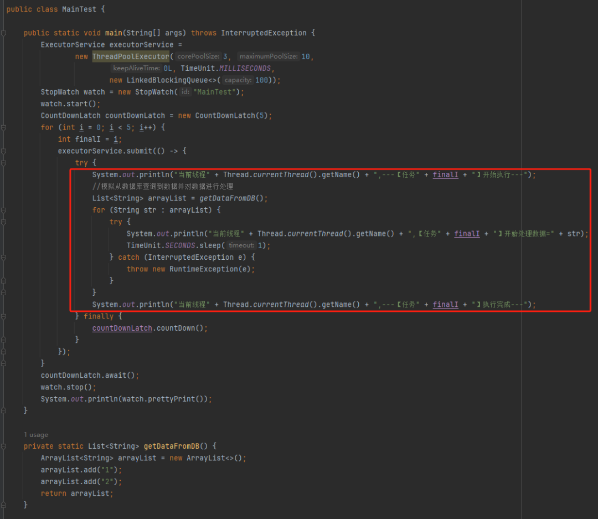

这个代码的逻辑非常简单，首先我们搞了一个线程池，然后起一个 for 循环往线程池里面仍了 5 个任务，这是核心逻辑。

对于这几个任务，我们的这个自定义线程池处理起来，不能说得心应手吧，至少也是手拿把掐。

其他的 StopWatch 是为了统计运行时间用的。至于 CountDownLatch，你可以理解为在业务流程中，需要这五个任务都执行完成之后才能往下走，所以我搞了一个 CountDownLatch。

这个代码运行起来是没有任何问题的，我们在日志中搜索“执行完成”，也能搜到 5 个，这个结果也能证明程序是正常结束的：

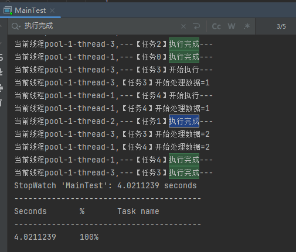

同时，可以看到运行时间是 4s。

示意图大概是这样的：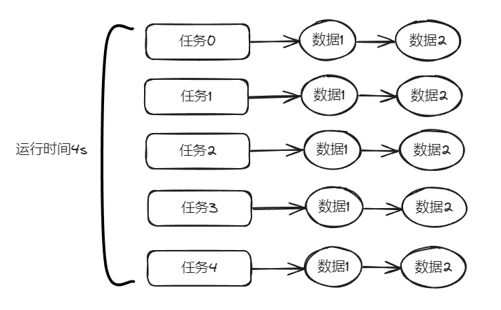

 然后我看着这个代码，发现了一个可以优化的地方： 

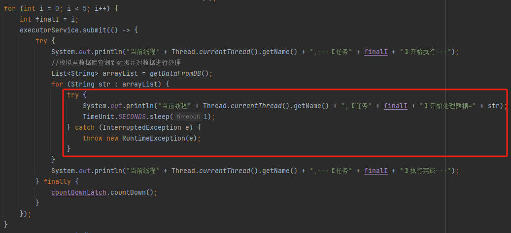

这个地方从数据库捞出来的数据，它们之间是没有依赖关系的，也就是说它们之间也是可以并行执行的。

所以我把代码改成了这样：

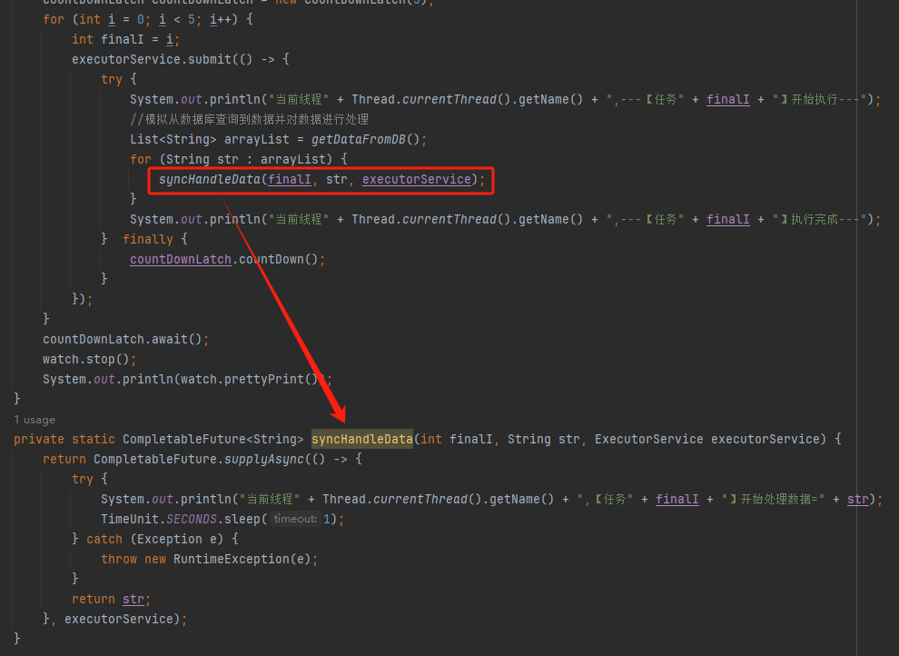

在异步线程里面去处理这部分从数据库中捞出来的数据，并行处理加快响应速度。

对应到图片，大概就是这个意思：

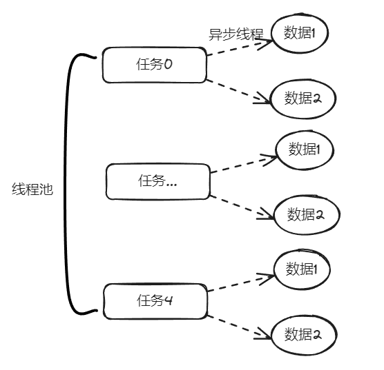

 把程序运行起来之后，日志变成了这样： 

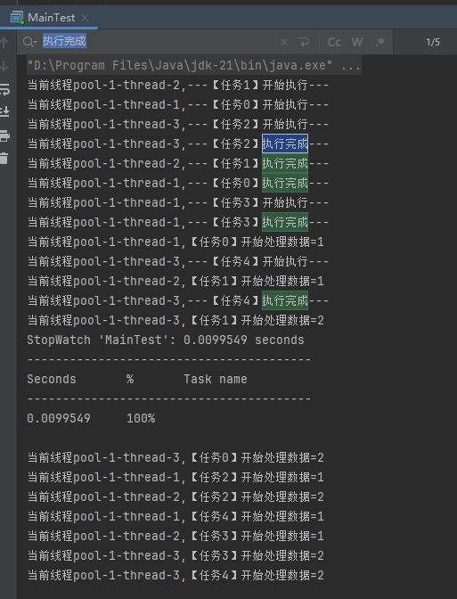

我们搜索“执行完成”，也能搜到 5 个对应输出。

而且我们就拿“任务2”来说：

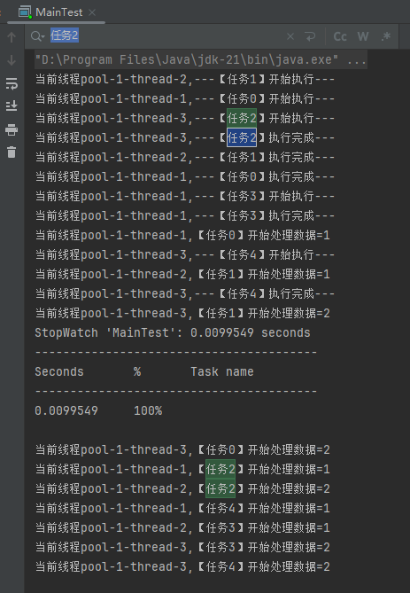

```java
当前线程pool-1-thread-3,---【任务2】开始执行---
当前线程pool-1-thread-3,---【任务2】执行完成---
当前线程pool-1-thread-1,【任务2】开始处理数据=1
当前线程pool-1-thread-2,【任务2】开始处理数据=2
```

从日志输出来看，任务 2 需要处理的两个数据，确实是在不同的异步线程中处理数据，也实现了我的需求。

但是，程序运行直接就是到了 9.9ms：

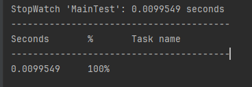

这个优化这么牛逼的吗？

从 4s 到了 9.9ms？

稍加分析，你会发现这里面是有问题的。

那么问题就来了，到底是啥问题呢？

....

....

....

问题就是由于转异步了，所以 for 循环里面的任务中的 countDownLatch 很快就减到 0 了。

于是 await 继续执行，所以很快就输出了程序运行时间。

然而实际上子任务还在继续执行，程序并没有真正完成。

9.9ms 只是任务提交到线程池的时间，每个任务的数据处理时间还没算呢：

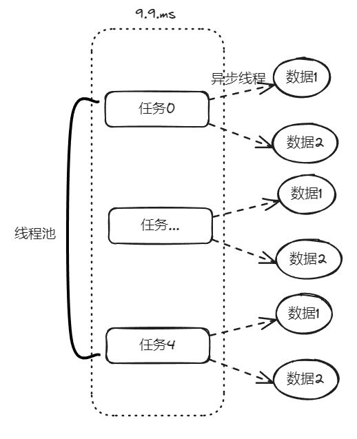

从日志输出上也可以看出，在输出了 StopWatch 的日志后，各个任务还在处理数据。

这样时间就显得不够真实。

那么我们应该怎么办呢？

很简单嘛，需要子任务真正执行完成后，父任务的 countDownLatch 才能进行 countDown 的动作。

具体实现上就是给子任务再加一个 countDownLatch 栅栏：

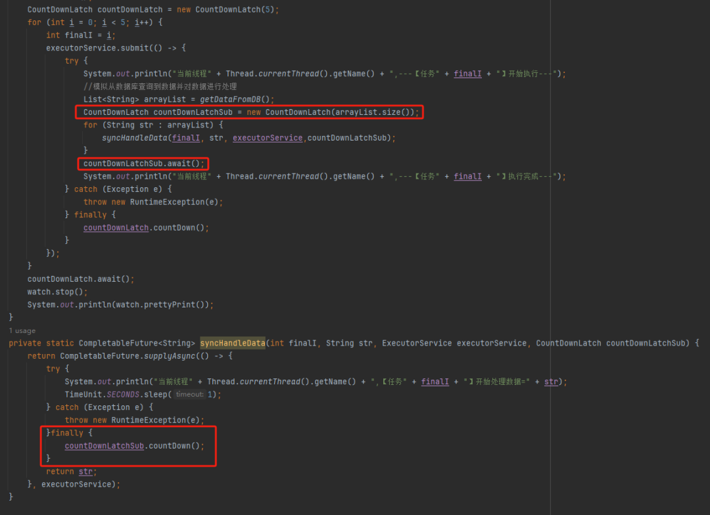

 我们希望的运行结果应该是这样的： 

```java
当前线程pool-1-thread-3,---【任务2】开始执行---
当前线程pool-1-thread-1,【任务2】开始处理数据=1
当前线程pool-1-thread-2,【任务2】开始处理数据=2
当前线程pool-1-thread-3,---【任务2】执行完成---
```

即子任务全部完成之后，父任务才能算执行完成，这样统计出来的时间才是准确的。

思路清晰，非常完美，再次运行，观察日志我们会发现：

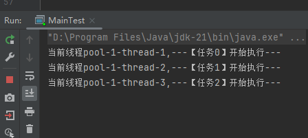

呃，怎么回事，日志怎么不输出了？

是的，就是不输出了。

不输出了，就是踩到这个坑了。

不论你重启多少次，都是这样：日志不输出了，程序就像是卡着了一样。

## 坑在哪儿

上面这个 Demo 已经是我基于遇到的生产问题，极力简化后的版本了。

现在，这个坑也已经呈现在你眼前了。

我们一起来分析一波。

首先，我问你：真的在线上遇到这种程序“假死”的问题，你会怎么办？

早几年，我们的习惯是抱着代码慢慢啃，试图从代码中找到端倪。

这样确实是可以，但是通常来说效率不高。

现在我的习惯是直接把现场 dump 下来，分析现场。

比如在这个场景下，我们直观上的感受是“卡住了”，那就 dump 一把线程，管它有枣没枣，打一杆子再说：

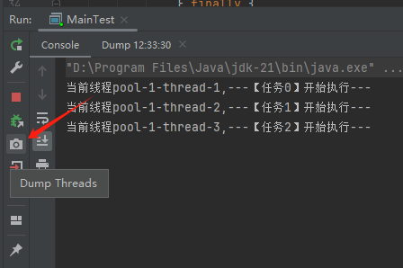

 通过 Dump 文件，可以发现线程池的线程都在 MainTest 的第 30 行上 parking ，处于等待状态： 

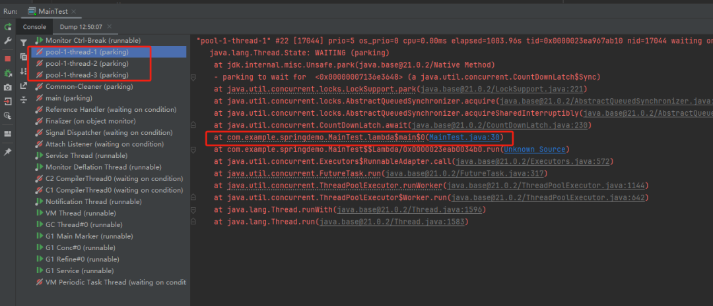

 那么第 30 行是啥玩意？ 

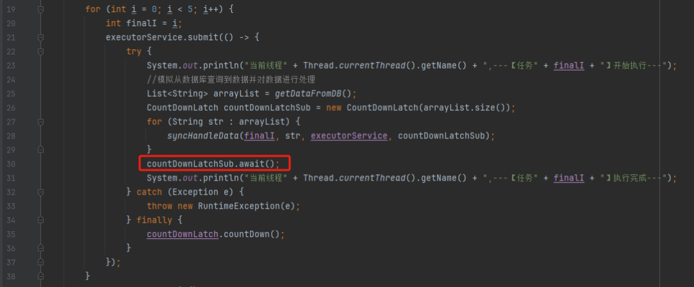

这行代码在干啥？

> countDownLatchSub.await();

是父任务在等待子任务执行结束，运行 finally 代码，把 countDownLatchSub 的计数 countDown 到 0，才会继续执行：

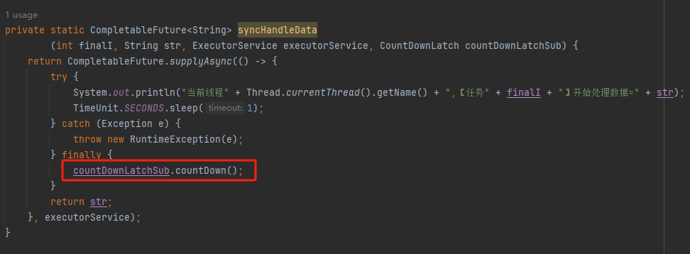

所以现在的现象就是子任务的 countDownLatchSub 把父任务的拦住了。

换句话说就是父任务被拦住是因为子任务的 finally 代码中的 countDownLatchSub.countDown() 方法没有被执行。

好，那么最关键的问题就来了：为什么没有执行？

你先别往下看，闭上眼睛在你的小脑瓜子里面推演一下，琢磨一下：finally 为什么没有执行？


或者再换个更加接近真实的问题：子任务为什么没有执行？

这个点，非常简单，可以说一点就破。

琢磨明白了，这个坑的原理摸摸清楚了。

...

...

...

琢磨明白了吗？你就刷刷往下看？

没明白我再给你一个信息：需要结合线程池的参数和运行原理来分析。

什么？

你说线程池的运行原理你不清楚？

...

...

...

好，不管你“恍然大悟”了没有，我来给你讲一下。

让你知道“一点就破”这四个是怎么回事儿。

首先，我们把目光聚焦在线程池这里：

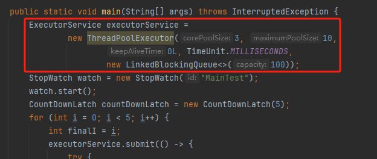

这个线程池核心线程数是 3，但是我们要提交 5 个任务到线程池去。

父任务哐哐哐，就把核心线程数占满了。

接下来子任务也要往这个线程池提交任务怎么办？

当然是进队列等着了。

一进队列，就完犊子。

到这里，我觉得你应该能想明白问题了。

应该给到我一个恍然大悟的表情，并配上“哦哦哦~”这样的内心 OS。


**你想想，父任务这个时候干啥？**

是不是等在 countDownLatchSub.await() 这里。

而 countDownLatchSub.await() 什么时候能继续执行？

是不是要所有子任务都执行 finally 后？

那么子任务现在在干啥？

是不是都在线程池里面的队列等着被执行呢？

那线程池队列里面的任务什么时候才执行？

是不是等着有空闲线程的时候？

那现在有没有空闲线程？

没有，所有的线程都去执行父任务去了。

**那你想想，父任务这个时候干啥？**

是不是等在 countDownLatchSub.await() 这里。

...

父任务在等子任务执行。

子任务在等线程池调度。

线程池在等父任务释放线程。

闭环了，相互等待了，家人们。

这，就是坑。

## 怎么避免

找到了坑的原因，解决方案就随之而出了。

父子任务不要共用一个线程池，给子任务也搞一个自定义线程池就可以了：


 运行起来看看日志： 

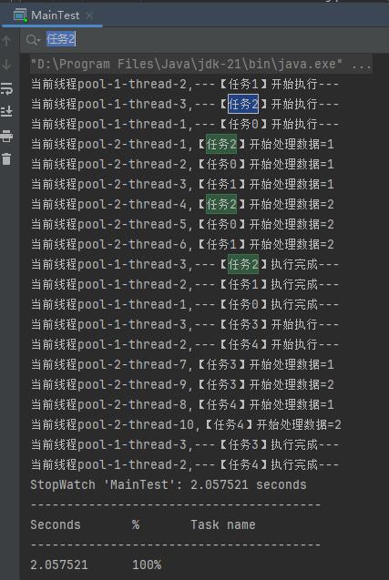

首先整体运行时间只需要 2s 了，达到了我想要的效果。

另外，我们观察一个具体的任务：

```java
当前线程pool-1-thread-3,---【任务2】开始执行---
当前线程pool-2-thread-1,【任务2】开始处理数据=1
当前线程pool-2-thread-4,【任务2】开始处理数据=2
当前线程pool-1-thread-3,---【任务2】执行完成---
```

日志输出符合我们前面分析的，所有子任务执行完成后，父任务才打印执行完成，且子任务在不同的线程中执行。

而使用不同的线程池，换一个高大上的说法就叫做：线程池隔离。

而且在一个项目中，公用一个线程池，也是一个埋坑的逻辑。

至少给你觉得关键的逻辑，单独分配一个线程池吧。

避免出现线程池的线程都在执行非核心逻辑了，反而重要的任务在队列里面排队去了。

这就有点不合理了。

最后，一句话总结这个问题：

>  如果线程池的任务之间存在父子关系，那么请不要使用同一个线程池。如果使用了同一个线程池，可能会因为子任务进了队列，导致父任务一直等待，出现假死现象。 