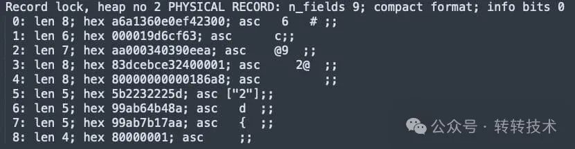
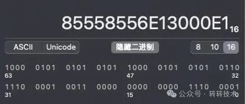
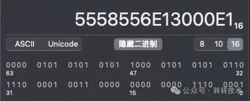
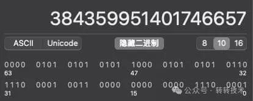
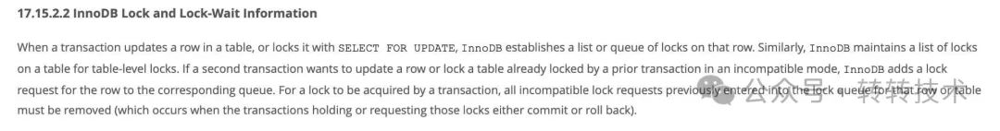
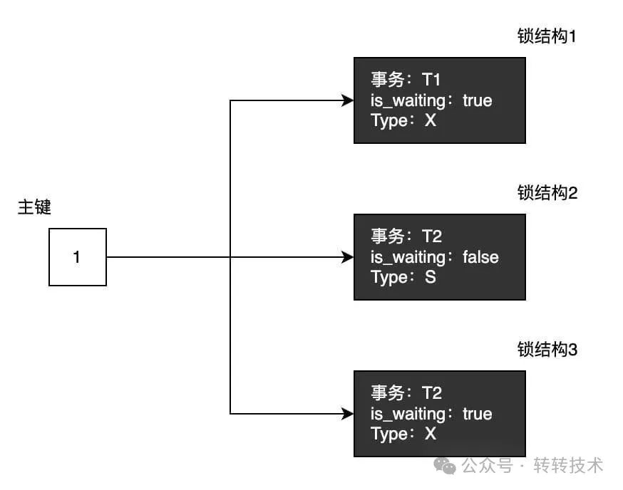

- 1、找到并确定你的死锁日志
  - 方式1：基于MySQL错误日志
  - 方式2：基于SHOW ENGINE INNODB STATUS命令查看最近发生的死锁日志
  - 方式3：咨询你的DBA吧！
-  2、分析你的死锁日志 
  -  1、确定死锁发生的时间 
  -  2、确定死锁发生的顺序 
  -  3、确定死锁发生的位置以及触发的SQL内容 
-  3、确定死锁原因 
  -  1、MySQL顺序加锁顺序解锁（公平锁） 
  -  2、死锁日志中出现的锁，不论是等待的锁，还是持有的，都是每个事务已经拥有的锁结构 
-  4、拓展：特殊情况加锁引起的死锁 

---

👉 是不是每次看到死锁日志就头大？

👉 明明只是简单的INSERT操作，数据库却神秘"卡死"？

看完本文，让你3步快速定位死锁原因！

## 1、 找到并确定你的死锁日志 

###  方式1：基于MySQL错误日志 

-  进入MySQL 
-  检查innodb_print_all_deadlocks变量： 

```sql
SHOW VARIABLES LIKE 'innodb_print_all_deadlocks';
```

-  如果innodb_print_all_deadlocks变量的值为OFF，则需要将其设置为ON以开启死锁日志。 

```sql
SET GLOBAL innodb_print_all_deadlocks = 1;
```

-  退出MySQL，查看下面的日志 

```sql
/usr/local/mysql/data/mysqld.local.err
```

###  方式2：基于SHOW ENGINE INNODB STATUS命令查看最近发生的死锁日志 

 输入该命令后，你需要去输出的信息中找到如下关键字 

```sql
------------------------ 
LATEST DETECTED DEADLOCK 
------------------------ 
```

 后面的内容即是最近一次发生的死锁的内容 

###  方式3：咨询你的DBA吧！ 

 专业的事情交给专业的人来！DBA会帮你找到最近的死锁信息的！ 

##  2、分析你的死锁日志 

 现在我们已经拿到了死锁日志 

```sql
2025-04-19 13:39:45 0x3079da000
*** (1) TRANSACTION:
TRANSACTION 10047, ACTIVE 10 sec starting index read
mysql tables in use 1, locked 1
LOCK WAIT 2 lock struct(s), heap size 1136, 1 row lock(s)
MySQL thread id 8, OS thread handle 13013229568, query id 113 localhost root updating
DELETE FROM t1 WHERE i = 1
*** (1) WAITING FOR THIS LOCK TO BE GRANTED:
RECORD LOCKS space id 44 page no 3 n bits 72 index PRIMARY of table `itsuka`.`t1` trx id 10047 lock_mode X locks rec but not gap waiting
Record lock, heap no 2 PHYSICAL RECORD: n_fields 3; compact format; info bits 0
 0: len 4; hex 80000001; asc     ;;
 1: len 6; hex 00000000273e; asc     >;;
 2: len 7; hex ad000001210110; asc     !  ;;

*** (2) TRANSACTION:
TRANSACTION 10048, ACTIVE 21 sec starting index read
mysql tables in use 1, locked 1
4 lock struct(s), heap size 1136, 2 row lock(s)
MySQL thread id 6, OS thread handle 13012672512, query id 114 localhost root updating
DELETE FROM t1 WHERE i = 1
*** (2) HOLDS THE LOCK(S):
RECORD LOCKS space id 44 page no 3 n bits 72 index PRIMARY of table `itsuka`.`t1` trx id 10048 lock mode S locks rec but not gap
Record lock, heap no 2 PHYSICAL RECORD: n_fields 3; compact format; info bits 0
 0: len 4; hex 80000001; asc     ;;
 1: len 6; hex 00000000273e; asc     >;;
 2: len 7; hex ad000001210110; asc     !  ;;

*** (2) WAITING FOR THIS LOCK TO BE GRANTED:
RECORD LOCKS space id 44 page no 3 n bits 72 index PRIMARY of table `itsuka`.`t1` trx id 10048 lock_mode X locks rec but not gap waiting
Record lock, heap no 2 PHYSICAL RECORD: n_fields 3; compact format; info bits 0
 0: len 4; hex 80000001; asc     ;;
 1: len 6; hex 00000000273e; asc     >;;
 2: len 7; hex ad000001210110; asc     !  ;;

*** WE ROLL BACK TRANSACTION (1)
```

通常我们拿到的死锁日志如上所示

接下来我们要做的事情包括：

###  1、确定死锁发生的时间 

```sql
2025-04-19 13:39:45 0x3079da000
*** (1) TRANSACTION:
```

 首先，我们基于死锁日志了解到死锁发生在2025-04-19 13:39:45分。再根据我们的业务日志，即可确定本次死锁的日志内容。 

###  2、确定死锁发生的顺序 

 在上面的例子中，发生死锁的两个事务分别是`10047`号事务 `(1) TRANSACTION`。 

```sql
*** (1) TRANSACTION:
TRANSACTION 10047, ACTIVE 10 sec starting index read
```

发生死锁时， `(1) TRANSACTION`已经进行了10秒的索引查询动作。

以及`10048`号事务`(2) TRANSACTION`

```sql
*** (2) TRANSACTION:
TRANSACTION 10048, ACTIVE 21 sec starting index read
```

发生死锁时，`(2) TRANSACTION`已经进行了21秒的索引查询动作。

我们知道，事务ID是顺序增加的，更大的事务ID意味着更晚分配事务ID。

那么有的同学就有疑问了，为什么 `(2) TRANSACTION`后于 `(1) TRANSACTION`创建，线程的执行时间却更长呢。

那是因为，对于读写事务来说，**只有在它第一次对某个表执行增删改操作时，才会为这个事务分配一个事务id**，否则是不分配事务 id 的。 有时，虽然我们开启了一个读写事务，但是这个事务中全是查询语句，并没有执行增删改操作的语句，这也就意味着这个事务并不会被分配一个事务id。 因此，虽然有时运行的时间长，反而后分配了事务ID。

基于事务ID的大小，我们可以确定， `(2) TRANSACTION`后于 `(1) TRANSACTION`:分配事务ID，但是`(2) TRANSACTION`更早运行。

###  3、确定死锁发生的位置以及触发的SQL内容 

 我们现在回到死锁日志。 

```sql
MySQL thread id 8, OS thread handle 13013229568, query id 113 localhost root updating
DELETE FROM t1 WHERE i = 1
```

这两行提示了死锁发生时当前事务执行的sql内容。

死锁发生时正在执行一条`delete`语句。

接着往下看。

```sql
*** (1) WAITING FOR THIS LOCK TO BE GRANTED:
RECORD LOCKS space id 44 page no 3 n bits 72 index PRIMARY of table `itsuka`.`t1` trx id 10047 lock_mode X locks rec but not gap waiting
```

这里展示了死锁发生时等待的锁的位置与内容 本次死锁发生在`PRIMARY`即主键索引行，死锁的表为`‘itsuka’`库的`‘t1’`表，并且正在等待一个`‘lock_mode X locks rec but not gap waiting’`锁。

那么`‘lock_mode X locks rec but not gap waiting’`锁是一个什么东西呢？

数据库中锁的类型大家都很熟悉，这里就不做介绍。只给出日志中各种锁对应的关键字：

| 锁类型                              | 关键字                                            |
| :---------------------------------- | :------------------------------------------------ |
| 记录锁（LOCK_REC_NOT_GAP）          | lock_mode X locks rec but not gap                 |
| 间隙锁（LOCK_GAP）                  | lock_mode X locks gap before rec                  |
| Next-key 锁（LOCK_ORNIDARY）        | lock_mode X                                       |
| 插入意向锁（LOCK_INSERT_INTENTION） | lock_mode X locks gap before rec insert intention |

基于此，我们可以确定，死锁发生时，`10047`号事务 `(1) TRANSACTION`，正在等待一个`主键索引`上的`排他记录锁`

那么等待的锁的具体内容是什么呢，或者说，他正在等待谁呢，我们接着往下看

```sql
Record lock, heap no 2 PHYSICAL RECORD: n_fields 3; compact format; info bits 0
 0: len 4; hex 80000001; asc     ;;
 1: len 6; hex 00000000273e; asc     '>;;
 2: len 7; hex ad000001210110; asc     !  ;;
```

这一段，表示等待的锁的具体信息，包括一些行的物理存储位置信息。

- 针对主键索引来着，这里保存的内容是

| 列编号 | 内容       |
| :----- | :--------- |
| 0      | 主键值     |
| 1      | 事务ID     |
| 2      | 回滚段指针 |
| 3      | 第二列值   |
| 4      | 第三列值   |
| 5      | 第四列值   |
| .....  | 以此类推   |

对应到上面的案例只有0、1、2的原因是，我的测试表的结构为

```sql
CREATE TABLE `t1`(
    `i` int(11) NOT NULL,
    PRIMARY KEY (`i`)
) ENGINE = InnoDB
```

 **因为只有主键列**，自然就没有后续的其他内容。对于更加复杂的表，我们也许会看到类似如下的信息： 



原理是一样的，事务ID 和 回滚段指针 列不需要过多关注，这里不展开说明。

那么，我们如何把其中对应的数值解析出来呢。

---

 针对有符号数值型存储，MySQL为了确保正数的数值一定大于负数，因此会将每一个数值拆成单个字节，再对最高位字节（最高的8个二进制位）的最高位与128（1000,0000）进行异或操作，相当于将正数和负数的符号位反过来。 

---

 我们找一条相对复杂的日志为例 

```sql
0: len 8; hex 85558556e13000e1; asc  U V 0  ;;
```

 将16进制值85558556e13000e1贴入计算器 



 可以观察到最高位二进制数字为1，说明在进行异或计算前这一位为0，我们将其高位修改为0。 



 于是我们得到16进制数字0x5558556E13000E1，再将其转为10进制。 



 这样一来我们就解析到了得到真正存储的数据：384359951401746657。 

 如法炮制，我们同样得到本次案例中的主键数据 

```sql
0: len 4; hex 80000001; asc     ;;
```

解析后得到1。即，**锁加在了主键为1的这一条记录上**。

**如果是字符类型，只需要按照对应的字符集切分成相同大小的字节块，每个字节块单独映射即可**。

通常针对字符类型的反算就是deepseek出场的时候了，但是数值类型还是我们手动来比较好，deepseek似乎算不太明白。

---

上面重点讲述了主键索引在死锁日志中的日志结构，二级索引结构很类似。

- 针对二级索引来说，这里保存的内容是

| 列编号   | 内容        |
| :------- | :---------- |
| 0        | 二级索引列1 |
| 1        | 二级索引列2 |
| 2        | 二级索引列3 |
| .....    | 以此类推    |
| 最后一行 | 主键值      |

**现在回到案例上来，我们现在已经确定了，事务1的死锁发生在‘itsuka’库的‘t1’表的主键索引上，死锁发生时正在等待自己的排他记录锁的获取，锁的位置位于主键索引上主键为1（80000001）那条记录**

 事务2的死锁日志大部分与事务1相同，只是多了如下内容 

```sql
*** (2) HOLDS THE LOCK(S):
RECORD LOCKS space id 44 page no 3 n bits 72 index PRIMARY of table `itsuka`.`t1` trx id 10048 lock mode S locks rec but not gap
Record lock, heap no 2 PHYSICAL RECORD: n_fields 3; compact format; info bits 0
 0: len 4; hex 80000001; asc     ;;
 1: len 6; hex 00000000273e; asc     '>;;
 2: len 7; hex ad000001210110; asc     !  ;;
```

这段表明，死锁发生时，`事务2`已经持有一把锁，锁的类型是`共享记录锁`，锁的位置为主键索引上主键为1

```
（ 0: len 4; hex 80000001; asc   ;;）
```

的那条记录。

同时，`事务2`的死锁发生时还在等待自己的`排他记录锁`的获取，锁的位置位于主键索引上主键为1

```
（ 0: len 4; hex 80000001; asc   ;;）
```

的那条记录

至此，我们的死锁日志就分析就全部结束了。

##  3、确定死锁原因 

基于上一节我们知道了，死锁发生时我们收集到了两个事务的信息。

`事务1`的事物ID为`10047`，事务执行的时间较短为10秒钟，死锁时正在等待获取一把独占型记录锁，这把锁加在了`‘itsuka’`库的`‘t1’`表的主键索引上主键为`1`的那条记录上。

`事务2`的事物ID为`10048`，事务执行的时间较长为21秒钟，死锁时正持有一把共享型记录锁，这把锁加在了`‘itsuka’`库的`‘t1’`表的主键索引上主键为`1`的那条记录上，同时`事务2`又尝试获取一把独占型记录锁，这把锁加在了`‘itsuka’`库的`‘t1’`表的主键索引上主键为1的那条记录上。

在开始我们下一阶段的思考之前，我们需要明确几个问题。

###  1、InnoDB顺序加锁顺序解锁（公平锁） 



 基于MySQL的官方文档，我们可以知道。一个事务成功加锁的前提是：**这条记录的锁等待队列中，当前事务前面所有不兼容的加锁请求都已释放（提交或回滚）** 

###  2、死锁日志中出现的锁，不论是等待的锁，还是持有的，都是每个事务已经拥有的锁结构 

有别于`java`中的锁，例如`ReentrantLock`。不管有几个线程来争抢这把锁，**自始至终都只有一个锁结构**，拿到锁的线程拥有这把锁，没拿到锁的线程不拥有这把锁。

**而MySQL每次加锁都会在内存中生成一个独属于这个事务的锁结构**，只不过锁结构里有一个等待状态的标志，表示这个锁获取成功还是失败。

在进行MySQL的加锁分析时，一定要明白，**不论当前事务有没有成功获取到锁，都已经建立了锁结构。**

因此，上述案例中的锁结构示意图如下所示。



接下来我们要做的就是逐个分析锁结构，判断他的来源以及为什么没能成功获取。

所以，该案例的死锁原因就找到了:

`T2事务`先获取了了`S型记录锁`，`T1事务`再尝试获取`X型记录锁`，与`S型记录锁`冲突，因此`T1事务`陷入等待。此时`T2事务`再尝试获取这条记录的`X型记录锁`，**根据请求锁的原则：这条记录的锁等待队列中，与T2事务的加锁请求冲突的锁都已释放（提交或回滚），T2事务才能加锁成功**。因此`T2事务`也陷入等待，并且`T2事务`需要等待`T1事务`先获取锁，但`T1事务`要等待`T2事务`的S型记录锁释放，死锁因此产生。

再结合我们的sql，我们就可以完整还原现场：

| 时间 | 事务1                             | 事务2                                                |
| :--- | :-------------------------------- | :--------------------------------------------------- |
| T1   |                                   | begin;select * from t1 where i=1 LOCK IN SHARE MODE; |
| T2   | begin;DELETE FROM t1 WHERE i = 1; |                                                      |
| T3   |                                   | DELETE FROM t1 WHERE i = 1;                          |

## 4、拓展：特殊情况加锁引起的死锁

 当然，很多时候死锁的产生并不完全是由两条 SQL 显式加锁导致的。MySQL 可能会背着我们偷偷的加一些锁，从而引发死锁。**但是不论是如何加锁，我们都要先找到死锁发生时，每个事务都涉及到了哪些锁结构，这些锁加在了哪里。然后再逐个分析，或者说‘猜’，这些锁是如何产生的。** 

---

例如，当MySQL在插入或者更新记录时出现唯一键冲突，那么会对重复的key加`S`类型的`next-key`锁。因为对于 MySQL 来说，不能直接报错，要先检查当前冲突记录是否为有效记录，如果发现冲突的记录被标记删除了，说明他不是有效记录，新纪录可以插入，否则要报错。为了防止其它事务更新或者删除这条记录、或者往这条记录前面的间隙里插入记录，**开始检查工作之前，MySQL 会对这条记录加共享锁。**

而当`insert` 语句带上`on duplicate key update`这个小尾巴时，这个小尾巴的作用是发现冲突记录时执行更新操作，**既然是更新操作则需要加排他锁，所以这种情况下发生唯一键冲突，就直接加排他锁。**

---

 更多加锁情况这里不展开讲，大家可以自行查阅官方文档，针对每种加锁场景都有明确的描述：`https://dev.mysql.com/doc/refman/5.7/en/innodb-locks-set.html` 