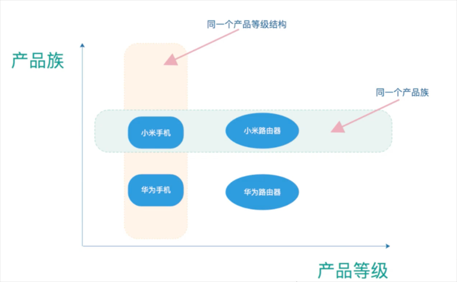

## 前言

工厂模式是比较经典的设计模式，也是工作中必用，面试必问的重点设计模式。工厂模式分为三种：

- 简单工厂模式

- 工厂方法模式

- 抽象工厂模式

> `核心本质`：
>
> 1. 实例化对象不再使用new，而用工厂方法代替；
> 2. 将实例化对象的代码提取出来，放到一个类中统一管理和维护，达到和主项目依赖关系的解耦。

接下来我们使用案例探讨一下这三种工厂模式的异同。

## 普通方式

场景：我们去商店购买电脑，商店里有苹果和联想两个牌子。

1. 先编写一个电脑接口：

```java
package com.monksweep.factory.normal;
	
public interface Computer {
    void name();
}
```

2. 编写苹果和联想两个类实现Computer接口：

```java
package com.monksweep.factory.normal;

public class MacBook implements Computer {
    @Override
    public void name() {
        System.out.println("苹果电脑");
    }
}
public class ThinkPad implements Computer{
    @Override
    public void name() {
        System.out.println("联想电脑");
    }
}
```

3. 创建一个购买类Buy用于购买电脑，假设我要买一个苹果电脑：

```java
public class Buy {
    public static void main(String[] args) {
        Computer computer = new MacBook();
        computer.name();
    }
}
```

输出结果：

```java
苹果电脑
Process finished with exit code 0
```

Q：这样的设计有什么问题？

A：在这种方式下你要获取一个computer对象，同时需要了解接口和它所有的实现类。比如说上面我要买个电脑，我需要自己去new一个对象，就相当于我造了一个电脑。

一般来说我们花钱买电脑就行了，不需要关注它是如何制造的。所以我们需要隐藏对象创建的细节，只需要告诉工厂我需要什么电脑，由工厂为我们创建就行了。

## 简单工厂模式

#### 基本介绍

简单工厂模式也叫`静态工厂模式`，**由一个工厂对象决定创建出哪一种产品类的实例**。它定义了一个创建对象的类，**由这个类来封装实例化对象的行为**。

#### 实现方法

1. 新建一个电脑工厂

```java
public class ComputerFactory {
    public static Computer buyComputer(String pcType) {
        if ("MacBook".equals(pcType)) {
            return new MacBook();
        } else if ("ThinkPad".equals(pcType)) {
            return new ThinkPad();
        } else {
            return null;
        }
    }
}
```

2. 这时候我们如果想购买一台电脑就简单了，只需要传入我们想要的电脑品牌，由电脑工厂去创建，而不需要再去实例化对象。

```java
public class Buy {
    public static void main(String[] args) {
        Computer thinkPad = ComputerFactory.createComputer("ThinkPad");
        thinkPad.name();
    }
}
```

执行结果：

```java
联想电脑
Process finished with exit code 0
```

#### 优缺点

优点：可以对创建的对象进行“加工”，对客户端隐藏相关细节。只关注结果，无需了解过程。

缺点：新增、删除子类均会违背开闭原则。

【思考】

如果商店里新增了微软的电脑，那么我们则需要修改工厂类，这样就违背了设计模式中的开闭原则(OCP)。如果想实现这样的需求，简单工厂模式是做不到的，需要使用工厂方法模式。

## 工厂方法模式

#### 基本介绍

定义了一个创建对象的抽象方法，由子类决定要实例化的类。工厂方法模式将**对象的实例化推迟到子类**。

#### 实现方法

1. 新建一个接口ComputerFactory（注意这里是接口，把简单工厂模式中的电脑工厂类抽象了）：

```java
public interface ComputerFactory {
    Computer createComputer();
}
```

2. 为每种类型的电脑都创建一个属于自己的工厂：

```java
public class MacBookFactory implements ComputerFactory{
    @Override
    public Computer createComputer() {
        return new MacBook();
    }
}
public class ThinkPadFactory implements ComputerFactory{
    @Override
    public Computer createComputer() {
        return new ThinkPad();
    }
}
public class SurfaceFactory implements ComputerFactory {
    @Override
    public Computer createComputer() {
        return new Surface();
    }
}
```

3. 尝试购买微软电脑：

```java
public class Buy {
    public static void main(String[] args) {
        ComputerFactory computerFactory = new SurfaceFactory();
        computerFactory.createComputer().name();
    }
}
```

输出结果：

```java
微软电脑
Process finished with exit code 0
```

#### 优缺点

优点：遵循开闭原则，新增具体产品时，不需要修改原有代码，直接扩展新的工厂和具体产品类即可。

缺点：

- 代码量多。增加新产品时，需要添加具体产品类和产品工厂类，随着业务增长，会给业务带来额外开销。

- 只支持同一类产品的创建。比如上面的案例，无论如何扩展，返回的具体产品都是电脑类对象，无法创建其他类别的产品，不利于扩展。

## 抽象工厂模式

#### 准备工作

在了解抽象工厂模式之前，需要先理解两个概念：

`产品等级`：即产品的继承结构。比如一个抽象类是手机，其子类包括小米手机，华为手机等，则抽象手机与具体的品牌手机之间构成了一个产品等级。

`产品族`：只是由同一个工厂生产的位于不同产品等级中的一组产品。比如小米工厂生产的小米手机、小米路由器，小米手机位于手机产品等级中，小米路由器位于路由器等级结构中，小米手机和小米路由器就构成了一个产品族。



#### 基本介绍

抽象工厂模式提供了一个创建一系列相关或者相互依赖对象的接口，**无需指定它们具体的类**。抽象工厂模式可以把简单工厂模式和工厂方法模式进行整合。

「结构」

1. **抽象工厂**：它声明了一组用于创建一族产品的方法，每一个方法对应一种产品。
2. **具体工厂**：它实现了在抽象工厂中声明的创建产品的方法，生成一组具体产品，这些产品构成了一个产品族，每一个产品都位于某个产品等级结构中。
3. **抽象产品**：它为每种产品声明接口，在抽象产品中声明了产品所具有的业务方法。
4. **具体产品**：它定义具体生产的具体产品对象，实现抽象产品接口中声明的方法。

#### 实现方法

1. 创建两个`抽象产品`接口：

```java
// 手机产品接口
public interface PhoneProduct {
    void sendSMS(); // 发短信
    void call(); // 打电话
}
// 路由器产品接口
public interface RouterProduct {
    void openWifi(); // 打开wifi
    void setting(); // 设置
}
```

2. 根据抽象产品接口创建`具体产品`：

```java
// 小米手机
public class XiaomiPhone implements PhoneProduct{
    @Override
    public void sendSMS() {
        System.out.println("小米手机发短信");
    }
    @Override
    public void call() {
        System.out.println("小米手机打电话");
    }
}
// 小米路由器
public class XiaomiRouter implements RouterProduct{
    @Override
    public void openWifi() {
        System.out.println("小米路由器打开Wifi");
    }
    @Override
    public void setting() {
        System.out.println("小米路由器设置");
    }
}
// 华为具体产品的实现方式一样，不再冗余展示...
```

3. 根据抽象产品创建一个`抽象工厂`：

```java
public interface ProductFactory {
    // 生产手机
    PhoneProduct phoneProduct();
    // 生产路由器
    RouterProduct routerProduct();
}
```

4. 根据抽象工厂创建`具体工厂`：

```java
// 小米工厂
public class XiaomiFactory implements ProductFactory{
    @Override
    public PhoneProduct phoneProduct() {
        return new XiaomiPhone();
    }
    @Override
    public RouterProduct routerProduct() {
        return new XiaomiRouter();
    }
}
// 华为工厂
public class HuaweiFactory implements ProductFactory{
    @Override
    public PhoneProduct phoneProduct() {
        return new HuaweiPhone();
    }
    @Override
    public RouterProduct routerProduct() {
        return new HuaweiRouter();
    }
}
```

5. 写一个客户端类测试一下：

```java
public class Client {
    public static void main(String[] args) {
        System.out.println("====小米系列产品====");
        XiaomiFactory xiaomiFactory = new XiaomiFactory();
        PhoneProduct phoneProduct = xiaomiFactory.phoneProduct();
        phoneProduct.call();
        phoneProduct.sendSMS();

        System.out.println("====华为系列产品====");
        HuaweiFactory huaweiFactory = new HuaweiFactory();
        RouterProduct routerProduct = huaweiFactory.routerProduct();
        routerProduct.openWifi();
        routerProduct.setting();
    }
}
```

输出结果：

```java
====小米系列产品====
小米手机打电话
小米手机发短信
====华为系列产品====
华为路由器打开Wifi
华为路由器设置
Process finished with exit code 0
```

上面的类比较多，看起来较为混乱，我们结合UML图来分析一下。


【分析】

从这张图可以清晰的看到客户端需要什么产品仅需访问华为和小米的工厂，而无需指定它们具体的类。每个产品的具体实现都由工厂来完成，对客户端隐藏了实现细节。

#### 优缺点

优点：具体产品在应用层的代码隔离，无需关心创建的细节；将一个系列的产品统一到一起创建。

缺点：规定了所有可能被创建的产品集合，产品族中扩展新的产品困难；增加了系统的抽象性和理解难度。


在抽象工厂模式中增加新的产品族很容易，但是增加新的产品等级结构很麻烦，抽象工厂模式的这种性质被称为`开闭原则的倾斜性`。

体现在代码中，比如说增加一个产品族**电脑**，那么所有实现抽象工厂的具体工厂都得修改，这也是抽象工厂模式最大的缺点；但是如果是增加一个产品等级结构**苹果**，那么是很容易扩展的，仅需要新增一个苹果工厂实现抽象工厂就可以了。

正是因为抽象工厂模式存在开闭原则的倾斜性，它以一种倾斜的方式来满足开闭原则，为增加产品族提供方便，但不能为增加产品等级结构提供方便，因此要求**设计人员在设计之初就能够考虑全面，防止在设计完成之后再向系统中增加新的产品等级结构**。

## 有态度的总结

再来回忆一下三种工厂模式的特点：

- 简单工厂模式

  用来生产同一等级结构中的任意产品（对于增加新的产品，需要修改已有代码）

- 工厂方法模式

  用来生产同一等级结构中的固定产品（支持增加任意产品）

- 抽象工厂模式

  围绕一个超级工厂创建其他工厂。该超级工厂又称为其他工厂的工厂

【个人拙见】

1. 三种工厂模式没有最好与最差，只有哪个最合适。
2. 设计模式的原则也并非一定要遵守，而是需要结合业务实际情况。