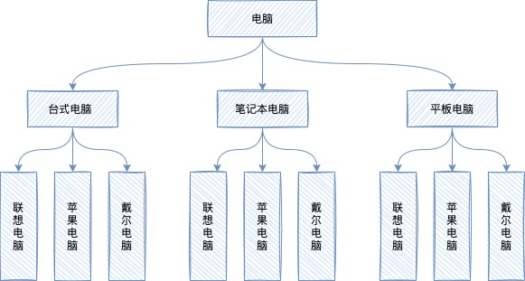

## 引言

桥接模式也是比较简单的设计模式，在日常工作生活中经常听到这个名字，熟悉而又陌生，那么我们今天来一探究竟，看看桥接模式到底是什么？

假设现在有这么个需求，创建不同类型的电脑，每种类型的电脑有不同的品牌，如下图：



我们常规的做法就是使用继承的方式来设计，但是缺点也很明显，假如我要增加一种类型或者品牌的电脑，就需要创建很多的类（类爆炸），扩展性很差。

而且这种设计方式违反了单一职责原则，例如`联想台式电脑`类，它既包含品牌，又包含电脑类型。

#### 分析

这个场景中有两个变化的维度：品牌，类型。


如果我们想增加类型或者品牌，仅需在横纵坐标上添加类即可，那么类型和品牌的交叉点正是我们理想的结果。

问题就聚焦到了实现交叉点的逻辑，使用桥接模式就可以完美解决这个问题。

## 桥接模式

#### 基本概念

`桥接模式`(Bridge Pattern)是将抽象部分与它的实现部分分离，使它们都可以独立地变化。它是一种对象结构性模式。

> `核心思想`
>
> - 分离抽象与具体
> - 用组合方式(桥)连接抽象与具体

#### 代码实现

接下来使用桥接模式实现上述案例需求。

1. 新建品牌接口，并提供苹果和联想的实现类

```java
// 品牌接口
public interface Brand {
    void info();
}
// 苹果品牌
class MacBook implements Brand{
    @Override
    public void info() {
        System.out.print("苹果");
    }
}
// 联想品牌
class ThinkPad implements Brand {
    @Override
    public void info() {
        System.out.print("联想");
    }
}
```

2. 新建类型的抽象类，提供笔记本和台式机的实现

```java
// 电脑类型接口
public abstract class Computer {
    // 使用组合的方式将品牌关联起来
    private Brand brand;

    public Computer(Brand brand) {
        this.brand = brand;
    }
    protected void info(){
        // 自带品牌
        this.brand.info();
    }
}
// 台式机类型
class Desktop extends Computer{
  
    public Desktop(Brand brand) {
        super(brand);
    }
  
    @Override
    protected void info() {
        super.info();
        System.out.println("台式机");
    }
}
// 笔记本类型
class Laptop extends Computer{

    public Laptop(Brand brand) {
        super(brand);
    }

    @Override
    protected void info() {
        super.info();
        System.out.println("笔记本");
    }
}
```

3. 客户端验证

```java
public class Client {
    public static void main(String[] args) {
        // 我想要一个苹果笔记本
        Computer computer = new Laptop(new MacBook());
        computer.info();

        // 我想要一个联想台式机
        Computer computer1 = new Desktop(new ThinkPad());
        computer1.info();
    }
}
```

输出结果：

```java
苹果笔记本
联想台式机
```


这样就实现了桥接模式，可能类比较多，不能体会到桥接模式的妙用，我们画个图来直观的感受一下为什么叫桥接模式：


对比一下使用继承的方式，是不是可以明显的感觉到桥接模式的魅力。既减少了类的数量，也增加了程序的扩展性，之后无论是增加电脑类型还是品牌，彼此互不影响，至于客户想要什么电脑，自己组装就行了。

#### 优缺点

优点：

- 桥接模式替代多继承方案，可以减少子类的个数，降低管理和维护成本。

- 桥接模式提高了系统的扩展性，在两个变化维度中任意扩展一个维度，都不需要修改原有系统。

缺点：

- 桥接模式的引入增加了系统的理解和设计难度，由于聚合关联关系建立在抽象层，要求开发者针对抽象进行设计与编程。
- 桥接模式要求正确识别出系统中**两个**独立变化的维度，因此其使用范围有一定的局限性。

#### 使用场景

**银行转账系统**

转账分类：网上，柜台，ATM

转账用户类型：普通，金卡，银卡

**消息管理**

消息类型：即使，延时

消息分类：短信，邮件，站内信

## 有态度的总结

1. 桥接模式使用组合替代了多重继承，减少类的个数，增加了扩展性；
2. 对于那些不希望使用继承或因为多重继承导致系统类个数急剧增加的系统，桥接模式尤为适用。